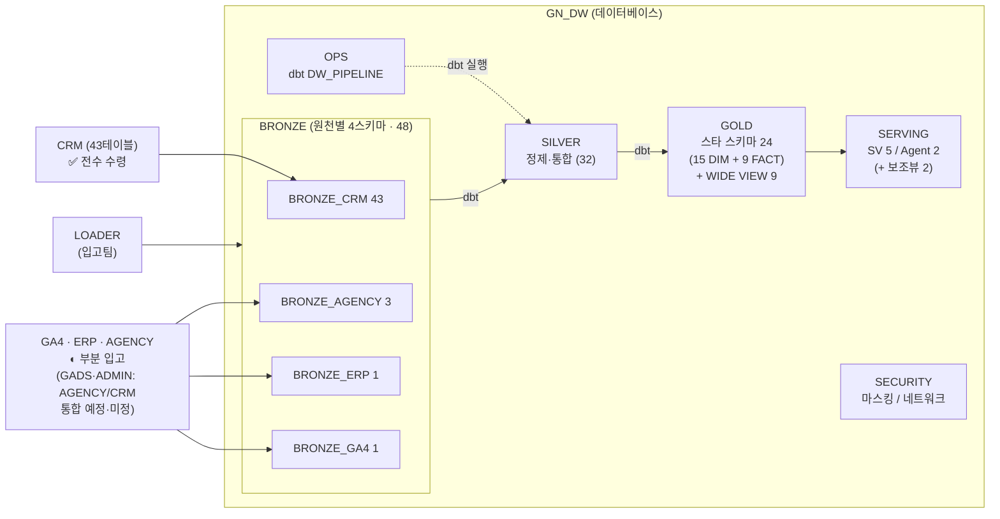
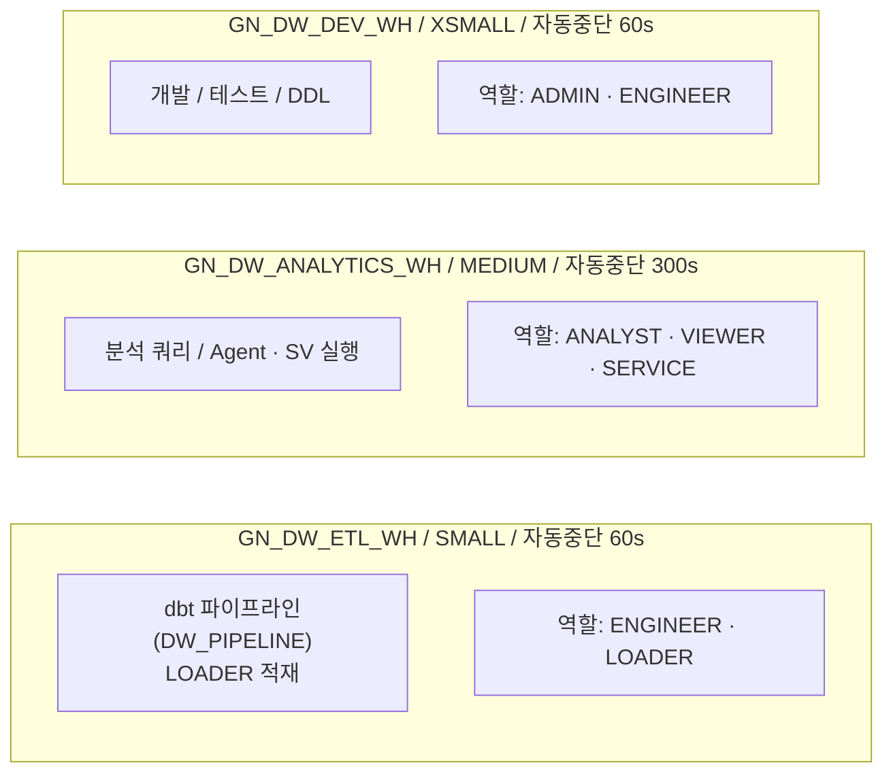
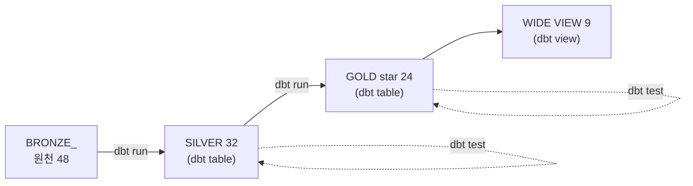
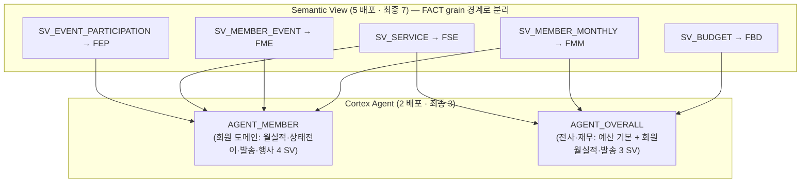

# GN_DW 전체 아키텍처 (Architecture Overview)

> 본 문서는 GN_DW 데이터 웨어하우스의 메달리온 아키텍처 전체 구성을 시각화한다(라이브 실측 2026-07-22). 상세 정의는 각 챕터(01~04) 및 정본 폴더 참조.

---

## 1. 데이터 흐름 (Data Flow)



> 데이터 도메인: CRM(✅전수 43) · GA4·ERP·AGENCY(◐부분 입고) + GADS·ADMIN(AGENCY/CRM 통합 예정·미정) → 물리 원천 4~6 가변.
> 계층 참조: **SERVING → GOLD → SILVER → BRONZE 단방향** (GOLD의 BRONZE 직접 참조 금지). OPS(dbt)·SECURITY는 운영/거버넌스 보조 스키마.
> ETL 전 구간(BRONZE→SILVER→GOLD→WIDE)은 dbt 프로젝트 `GN_DW.OPS.DW_PIPELINE`(65 models)이 수행.

---
<div style="page-break-before: always;"></div>

## 2. 계층별 역할 (Layer Responsibilities)

| Layer | Schema | 객체 (라이브) | 핵심 원칙 |
|---|---|---|---|
| 원천(도메인) | (외부) | CRM 43 ✅ + GA4·ERP·AGENCY 부분 / GADS·ADMIN 통합예정 | 입고팀 정의서 기반, SoT |
| 적재 | BRONZE_CRM/AGENCY/ERP/GA4 | 물리 테이블 48 (원천 1:1) | 원천별 분리 적재, 멱등성(P6) |
| 통합·정제 | SILVER | 물리 테이블 32 (dbt) | 타입/NULL/코드라벨/UNION·JOIN, 행 grain 유지 |
| 분석 | GOLD | star 24 (15 DIM+9 FACT, base measure 61) + WIDE VIEW 9 | SILVER만 참조(P2), 집계 grain |
| 소비/서비스 | SERVING | SV 5 + Agent 2 + 보조뷰 2 | GOLD cross-schema 참조(P7) |
| 운영 | OPS | dbt PROJECT DW_PIPELINE | ETL 오케스트레이션 |
| 거버넌스 | SECURITY | 정책 객체 | 보안 격리 |

> 원천 현황: **CRM 43테이블 전수 수령**. GA4·ERP·AGENCY는 부분 입고(GA4 1일 샤드·ERP 예산원장·AGENCY 광고 스캐폴드) → 전기간/잔여 입고 후 SILVER/GOLD/SV 자동 확장(S-6). GADS·ADMIN은 AGENCY/CRM 통합 예정(목적지·접두사 미정) — GOLD 귀속(GADS→FAD / ADMIN→FSE)만 확정.
> BRONZE는 **원천별 스키마 분리**(`BRONZE_CRM`·`BRONZE_AGENCY`·`BRONZE_ERP`·`BRONZE_GA4`)로 구현(단일 BRONZE 아님). [실측] CRM 43·GA4 `events_20260501` 287,025행·AGENCY 3(DGT 197,686/VIDEO 35,822/REBRDC 2,064)·ERP `BDGT_ACMSLT_LEDGER` 2,041행. **SILVER 32·GOLD 24+WIDE 9·SERVING SV5/Agent2 전량 배포 완료.**

---

<div style="page-break-before: always;"></div>

## 3. RBAC 역할 계층 (Role Hierarchy)

```
                    ACCOUNTADMIN
                         │
              ┌──────────┴──────────┐
              │                     │
          SYSADMIN            SECURITYADMIN
              │
         GN_DW_ADMIN ─────────────────────────────────────┐
              │                                           │
    ┌─────────┼───────────┬───────────────┐               │
    │         │           │               │               │
GN_DW_     GN_DW_      GN_DW_         GN_DW_          GN_DW_
ENGINEER   ANALYST     LOADER         SERVICE          (ADMIN)
    │         │                                      owns all
    │    GN_DW_VIEWER                                schemas
    │
    └── ETL/dbt 파이프라인 운영
```

### 역할별 스키마 접근 매트릭스

```
Role            │ BRONZE_* │ SILVER │ GOLD        │ SERVING        │ OPS    │ SECURITY
────────────────┼──────────┼────────┼─────────────┼────────────────┼────────┼─────────
GN_DW_ADMIN     │ ALL      │ ALL    │ ALL         │ ALL            │ ALL    │ ALL
GN_DW_ENGINEER  │ SELECT   │ ALL    │ ALL         │ USAGE          │ USAGE  │ -
                │          │        │ (dbt CREATE │                │ (dbt)  │
                │          │        │  TABLE/VIEW)│                │        │
GN_DW_ANALYST   │ -        │ SELECT │ SELECT      │ SV/Agent       │ -      │ -
GN_DW_VIEWER    │ -        │ -      │ SELECT      │ SV/Agent       │ -      │ -
GN_DW_LOADER    │ INSERT   │ -      │ -           │ -              │ -      │ -
                │ UPDATE   │        │             │                │        │
GN_DW_SERVICE   │ -        │ -      │ SELECT      │ SV/Agent       │ -      │ -
```

> GOLD는 물리 테이블(DIM/FACT)+WIDE VIEW 계층이므로 ENGINEER는 dbt 실행을 위한 `CREATE TABLE`·`CREATE VIEW` 권한을 가진다. 소비 역할(ANALYST/VIEWER/SERVICE)은 GOLD SELECT + SERVING SV/Agent 접근. Role 6종·WH 3종은 라이브 실측 확인.

---

<div style="page-break-before: always;"></div>

## 4. Warehouse 워크로드 분리 (Compute Isolation)



---

<div style="page-break-before: always;"></div>

## 5. ETL 파이프라인 (dbt Orchestration)



> 실행: dbt 프로젝트 `GN_DW.OPS.DW_PIPELINE` (65 models = SILVER 32 + GOLD 24 + WIDE 9). 품질 게이트 = dbt schema tests(relationships=warn·핵심 PK=error). 정기 스케줄(cron Task 래핑)은 향후 도입.
> 구설계의 Serverless Task DAG(`VALIDATE_BRONZE`→`REFINEMENT_ROOT`→`LOAD_GOLD`→`FINALIZER`)·정제 프로시저·`ETL_LOG`·예측(Forecast) 파이프라인은 **전량 폐기**(dbt 전환·forecast 제외 2026-07-10).

---

## 6. SERVING 계층 상세 (AI Layer)



> 배포 SV 5(FMM·FME·FSE·FEP·FBD). 미배포 2(FGA·FAD/FTG 계열) = 최종 7 목표의 Phase-2 확장.
> Agent 2(AGENT_MEMBER·AGENT_OVERALL), owner=GN_DW_ADMIN, Snowflake Intelligence(CoWork) 연결·소비 3역할 USAGE.
> 정확도 메커니즘: synonyms(한글)·VQR·custom instruction(기간스코프 강제 P10)·평가셋. 모든 참조: `GN_DW.GOLD.FACT_*/DIM_*`(cross-schema) + SERVING 보조뷰(DIM_MEMBER_CURRENT·DIM_MONTH)로 fan-out 차단.
> ⚠️ [6-C] 트라이얼 계정 DATA_AGENT_RUN 차단 → NL 스모크는 paid 이관 대기. Streamlit은 현재 미배포.
> SV/Agent 정본 = `05_SV-Agent_ai/`.

### GOLD star schema 24 (적재 정본 — `03_top-down_gold/06_DDL.sql`, dbt 모델화)

```
DIM (15)  DIM_DATE  DIM_MEMBER  DIM_MEMBER_IDENTITY  DIM_CAMPAIGN  DIM_SPONSORSHIP
          DIM_ORG  DIM_AD_CREATIVE  DIM_GA_SOURCE  DIM_GA_EVENT  DIM_SERVICE
          DIM_PAYMENT  DIM_REASON  DIM_DEVICE  DIM_EVENT  DIM_BUDGET_ITEM
FACT (9)  FACT_MEMBER_MONTHLY(FMM)   FACT_MEMBER_EVENT(FME)    FACT_TARGET_DEV(FTG-D)
          FACT_TARGET_BIZ(FTG-B·0행)  FACT_SERVICE_EVENT(FSE)   FACT_GA_BEHAVIOR(FGA)
          FACT_AD_PERFORMANCE(FAD)   FACT_EVENT_PARTICIPATION(FEP)   FACT_BUDGET(FBD)
WIDE (9)  각 FACT 1:1 평탄화 VIEW (WIDE_MEMBER_MONTHLY … WIDE_TARGET_BIZ)
          → base measure 61  (지표 215 → measure 60 + dimension 74 + derived 81)
```

---

<div style="page-break-before: always;"></div>

## 7. 보안 & 거버넌스 (Security & Governance)

```
┌─────────────────────── SECURITY 스키마 (MANAGED ACCESS) ──────────┐
│                                                                   │
│  Network Rules          │  Network Policy       │  Masking Policy │
│  ───────────────────    │  ──────────────────   │  ────────────── │
│  NR_OFFICE_IP (사무실)  │  NP_GN_DW             │  동적 마스킹    │
│  NR_VPN_IP   (VPN)      │  (ALLOWED LIST 방식)  │  (역할 기반)    │
│  NR_SERVICE_IP (서버)   │                       │                 │
└───────────────────────────────────────────────────────────────────┘

┌─────────────────────── OPS 스키마 ────────────────────────────────┐
│  DBT PROJECT DW_PIPELINE (ETL 오케스트레이션)                     │
│  ── 향후(설계안): Resource Monitor / Alert / Cost View ──         │
└───────────────────────────────────────────────────────────────────┘
```

> 보안 정책(네트워크/마스킹)·모니터링(RM/Alert/Cost)은 설계안이며 운영 승격 시 배포. 상세는 `04_운영 확인.md` 7~8장.

---

## 8. 구축 실행 흐름 (Execution Sequence)

```
Step  1 ─── 환경(TZ, WH 3종)                                    ✅ 라이브
Step  2 ─── Role 6종 + 계층                                      ✅ 라이브
Step  3 ─── Database + Schema (BRONZE 4 + SILVER/GOLD/SERVING/OPS/SECURITY) ✅
Step  4 ─── BRONZE 적재 48 (CRM 43 ✅ / GA4·ERP·AGENCY 부분)     ◐ 부분
Step  5 ─── dbt: SILVER 32 산출                                  ✅ 라이브
Step  6 ─── dbt: GOLD star 24 + WIDE VIEW 9                       ✅ 라이브
Step  7 ─── Semantic View 5 (최종 7)                             ✅ 배포
Step  8 ─── Cortex Agent 2 (최종 3)                              ✅ 배포
Step  9 ─── Grants + Future Grants                               ✅
Step 10 ─── 테스트 (권한/E2E/정합성 · dbt test)                  ✅
Step 11 ─── 보안 (네트워크/마스킹/MFA)                           ○ 설계안
Step 12 ─── 모니터링 (Resource Monitor/Alert/Cost)               ○ 설계안
```

> Streamlit 앱은 현재 미배포(향후 별도 트랙). ETL은 dbt 파이프라인으로 대체됨.

---

<div style="page-break-before: always;"></div>

## 9. 핵심 설계 원칙 요약 (Key Principles)

| ID | 원칙 | 설명 |
|---|---|---|
| P1 | Layer Separation | BRONZE(원천 1:1 보존)→SILVER(정제·통합)→GOLD(분석 star schema+WIDE), SERVING = 소비 |
| P2 | No Bronze Direct Ref | `SERVING→GOLD→SILVER→BRONZE` 단방향. GOLD는 BRONZE 직접 참조 금지 |
| P3 | GOLD Access Control | GOLD는 물리 star schema+WIDE VIEW. 소비는 SERVING SV/Agent 경유, 직접 접근은 SELECT 한정 |
| P4 | Role Hierarchy | 모든 Custom Role → SYSADMIN 귀속 |
| P5 | Workload Isolation | 용도별 WH 분리 (ETL / 분석 / 개발) |
| P6 | Idempotency | dbt run 재실행 안전(table CREATE OR REPLACE / view 재생성) |
| P7 | Serving Separation | SV/Agent는 GOLD가 아닌 SERVING 스키마 |

---

> **관련 문서:** `01_환경_Role.md` · `02_DB_BRONZE_SILVER.md` · `03_GOLD_SERVING.md` · `04_운영 확인.md` · **GOLD 정본** `../03_top-down_gold/06_DDL.sql` · **SV/Agent 정본** `../05_SV-Agent_ai/` · **dbt** `../10_dbt_pipeline/`
