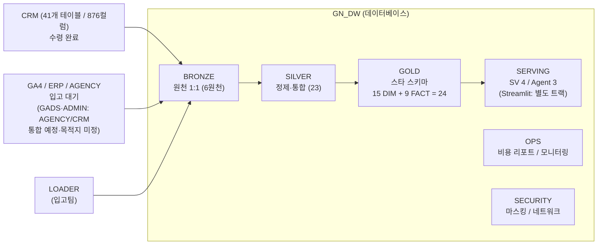
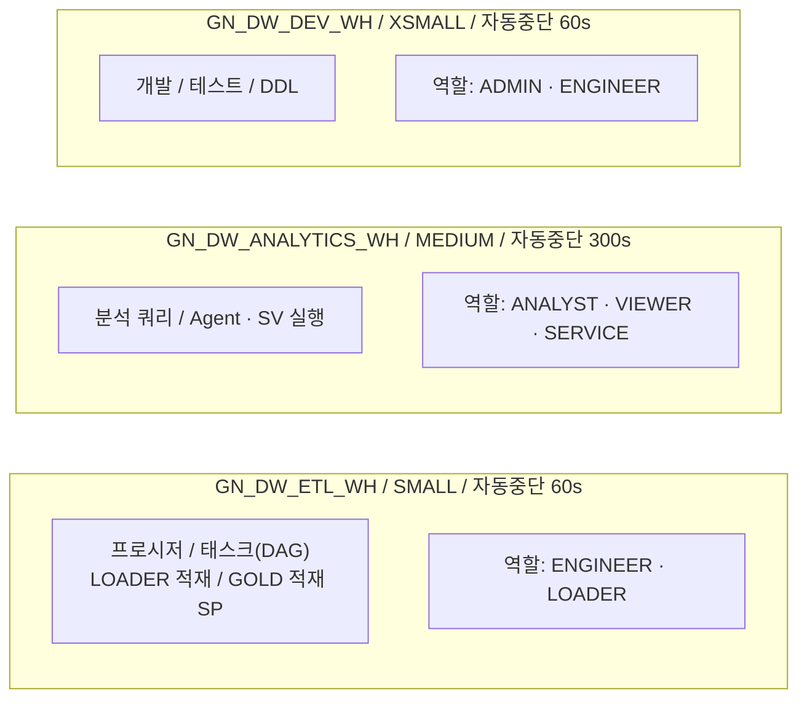
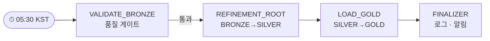
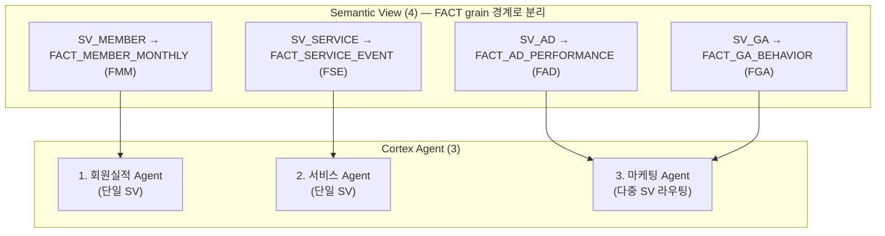

# GN_DW 전체 아키텍처 (Architecture Overview)

> 본 문서는 GN_DW 데이터 웨어하우스의 메달리온 아키텍처 전체 구성을 시각화한다. 상세 정의는 각 챕터(01~04) 및 `03_top-down_gold/` 참조.

---

## 1. 데이터 흐름 (Data Flow)



> 데이터 도메인: CRM(✅수령) · GA4 · ERP · AGENCY + GADS·ADMIN. GA4·ERP·AGENCY는 입고 대기, **GADS·ADMIN은 AGENCY 또는 CRM으로 통합 예정(목적지·접두사 미정)** → 물리 원천 4~6 가변.
> CRM 접두사 구성(현재 41테이블 기준, 추후 확장 가능): SND_(2)·TC_(2)·TD_MS_(8)·TH_(2)·TM_CM_(6)·TM_MM_(7)·TM_MS_(5)·TM_PM_(3)·TM_RM_(6).
> 계층 참조: **SERVING → GOLD → SILVER → BRONZE 단방향** (GOLD의 BRONZE 직접 참조 금지). OPS·SECURITY는 운영/거버넌스 보조 스키마.


---
<div style="page-break-before: always;"></div>

## 2. 계층별 역할 (Layer Responsibilities)

| Layer | Schema | 객체 유형 | 핵심 원칙 |
|---|---|---|---|
| 원천(도메인) | (외부) | CRM 41(확장가능) + GA4·ERP·AGENCY 대기 / GADS·ADMIN 통합예정 | 입고팀 정의서 기반, SoT |
| 적재 | BRONZE | 물리 테이블 (원천 1:1) | 6원천 1:1 전량 적재, 멱등성(P6) |
| 통합·정제 | SILVER | 물리 테이블 (23) | 타입/NULL/코드라벨/중복제거/동일소스 JOIN |
| 분석 | GOLD | star schema 24 (15 DIM + 9 FACT, base measure 61) | SILVER만 참조(P2), 집계 granularity |
| 소비/서비스 | SERVING | SV(4) + Agent(3) | GOLD cross-schema 참조(P7) |
| 운영 | OPS | 비용 View, 메타 | 운영 가시성 |
| 거버넌스 | SECURITY | 정책 객체 | 보안 격리 |

> 원천 현황: **CRM 41테이블/876컬럼 전수 수령(현재 기준·추후 확장 가능)**. GA4·ERP·AGENCY 미수령 → 입고 후 SILVER/GOLD 활성(S-6). GADS·ADMIN은 2026-06-24 정의서 추가 도메인이나 **AGENCY 또는 CRM으로 통합 예정(목적지·접두사 미정)** — GOLD 귀속(GADS→FAD / ADMIN→FSE)만 확정.
> ⚠️ 실제 GN_DW DB 스키마는 **원천별 분리**(`BRONZE_CRM`·`BRONZE_GA4`·`BRONZE_ERP`·`BRONZE_AGENCY`)로 구현됨(단일 BRONZE 아님). [2026-07-13 실측] CRM 43테이블/927컬럼·GA4 `events_20260501` **287,025행(전체 1일 샤드)**·AGENCY 3테이블·ERP `BDGT_ACMSLT_LEDGER` 2,041행 적재됨. **GOLD·SILVER 스키마는 아직 미생성**(설계·DDL만 완료, CREATE 미실행).

---

<div style="page-break-before: always;"></div>

## 3. RBAC 역할 계층 (Role Hierarchy)

```
                    ACCOUNTADMIN
                         │
              ┌──────────┴──────────┐
              │                     │
          SYSADMIN            SECURITYADMIN
              │
         GN_DW_ADMIN ─────────────────────────────────────┐
              │                                           │
    ┌─────────┼───────────┬───────────────┐               │
    │         │           │               │               │
GN_DW_     GN_DW_      GN_DW_         GN_DW_          GN_DW_
ENGINEER   ANALYST     LOADER         SERVICE          (ADMIN)
    │         │                                      owns all
    │    GN_DW_VIEWER                                schemas
    │
    └── ETL/프로시저/태스크 운영
```

### 역할별 스키마 접근 매트릭스

```
Role            │ BRONZE │ SILVER │ GOLD        │ SERVING        │ OPS    │ SECURITY
────────────────┼────────┼────────┼─────────────┼────────────────┼────────┼─────────
GN_DW_ADMIN     │ ALL    │ ALL    │ ALL         │ ALL            │ ALL    │ ALL
GN_DW_ENGINEER  │ SELECT │ ALL    │ USAGE       │ USAGE          │ SELECT │ -
                │        │        │ SELECT      │                │        │
                │        │        │ CREATE      │                │        │
                │        │        │  TABLE/VIEW │                │        │
GN_DW_ANALYST   │ -      │ SELECT │ SELECT      │ SV/Agent       │ SELECT │ -
GN_DW_VIEWER    │ -      │ -      │ SELECT      │ SV/Agent       │ -      │ -
GN_DW_LOADER    │ INSERT │ -      │ -           │ -              │ -      │ -
                │ UPDATE │        │             │                │        │
GN_DW_SERVICE   │ -      │ -      │ SELECT      │ SV/Agent       │ -      │ -
```

> GOLD는 물리 테이블(DIM/FACT) 계층이므로 ENGINEER는 `CREATE TABLE`(star schema 적재)·`CREATE VIEW` 권한을 가진다. 소비 역할(ANALYST/VIEWER/SERVICE)은 GOLD SELECT + SERVING SV/Agent 접근.

---

<div style="page-break-before: always;"></div>

## 4. Warehouse 워크로드 분리 (Compute Isolation)



---

<div style="page-break-before: always;"></div>

## 5. ETL 파이프라인 DAG (Task Orchestration)



> 실행 모드: Serverless (자동 스케일링, 3회 연속 실패 시 중단). `TASK_LOAD_GOLD` 적재 프로시저는 별도 트랙(04 범위 밖).

> 현행 GOLD는 **물리 star schema 적재**(DIM/FACT MERGE)이며, 레거시의 GOLD 예측 View 갱신 단계(`TASK_REFRESH_FORECAST`)는 현행 24테이블에 예측 테이블이 없어 제외.

---

## 6. SERVING 계층 상세 (AI Layer)



> SV별 도메인: MEMBER(회원 실적·목표대비·유지/중단) · SERVICE(발송·수신·참여·이벤트·앱푸시) · AD(광고 노출·클릭·전환·집행예산) · GA(세션·이탈율·스크롤).
> 정확도 메커니즘: synonyms(한글) · VQR · custom instruction(시간가용성/NULL) · 평가셋.
> derived 81 metric 전수 배속(MEMBER 48 · SERVICE 24 · AD 4 · GA 2 · 보류 3). 모든 참조: `GN_DW.GOLD.FACT_* / DIM_*` (cross-schema).
> ※ Streamlit 앱은 현행 SV/Agent 설계(05) 범위 밖 — 별도 소비 트랙.
> ※ 본 SV 4 / Agent 3은 **star schema 기반 목표 상태**이며 정본은 `05_SV-Agent_ai/`. `03_GOLD_SERVING.md`의 **레거시 SV 7 / Agent 1**은 PoC 이관 현재 상태로, 전환 로드맵의 시작점이다(수치 상충 아님).

### GOLD star schema 24 (적재 정본 — `03_top-down_gold/06_DDL.sql`)

```
DIM (15)  DIM_DATE  DIM_MEMBER  DIM_MEMBER_IDENTITY  DIM_CAMPAIGN  DIM_SPONSORSHIP
          DIM_ORG  DIM_AD_CREATIVE  DIM_GA_SOURCE  DIM_GA_EVENT  DIM_SERVICE
          DIM_PAYMENT  DIM_REASON  DIM_DEVICE  DIM_EVENT  DIM_BUDGET_ITEM
FACT (9)  FACT_MEMBER_MONTHLY(FMM)   FACT_MEMBER_EVENT(FME)    FACT_TARGET_DEV(FTG-D)
          FACT_TARGET_BIZ(FTG-B)     FACT_SERVICE_EVENT(FSE)   FACT_GA_BEHAVIOR(FGA)
          FACT_AD_PERFORMANCE(FAD)   FACT_EVENT_PARTICIPATION(FEP)   FACT_BUDGET(FBD)
          → base measure 61  (지표 215 → measure 60 + dimension 74 + derived 81)
```

---

<div style="page-break-before: always;"></div>

## 7. 보안 & 거버넌스 (Security & Governance)

```
┌─────────────────────── SECURITY 스키마 ───────────────────────────┐
│                                                                   │
│  Network Rules          │  Network Policy       │  Masking Policy │
│  ───────────────────    │  ──────────────────   │  ────────────── │
│  NR_OFFICE_IP (사무실)  │  NP_GN_DW             │  동적 마스킹    │
│  NR_VPN_IP   (VPN)      │  (ALLOWED LIST 방식)  │  (역할 기반)    │
│  NR_SERVICE_IP (서버)   │                       │                 │
└───────────────────────────────────────────────────────────────────┘

┌─────────────────────── OPS 스키마 ────────────────────────────────┐
│                                                                   │
│  Resource Monitor (4)   │  Alert (3)            │  Cost Views (2) │
│  ───────────────────    │  ──────────────────   │  ────────────── │
│  계정/WH별 크레딧 상한  │  비용 급증 알림       │  비용 분석 집계  │
│  임계 80%/95% SUSPEND   │  태스크 실패 알림     │                 │
└───────────────────────────────────────────────────────────────────┘
```

---

## 8. 구축 실행 흐름 (Execution Sequence)

```
Step  1 ─── 환경(TZ, WH 3종)
Step  2 ─── Role 6종 + 계층
Step  3 ─── Database + Schema 6종
Step  4 ─── BRONZE 테이블 (원천 1:1 — CRM 41 ✅[확장 가능] / GA4·ERP·AGENCY 입고 후 / GADS·ADMIN 통합 예정·미정)
Step  5 ─── 정제 프로시저 → SILVER 23 산출 (소스별 정제·통합)
Step  6 ─── GOLD star schema 24 적재 (15 DIM + 9 FACT, base measure 61)
Step  7 ─── Semantic View 4 (SV_MEMBER/SERVICE/AD/GA)
Step  8 ─── Cortex Agent 3 (회원실적/서비스/마케팅)
Step  9 ─── Grants + Future Grants
Step 10 ─── Task DAG 4종
Step 11 ─── 테스트 (권한/E2E/정합성)
Step 12 ─── 보안 (네트워크/마스킹/MFA)
Step 13 ─── 모니터링 (Resource Monitor/Alert/Cost)
```

> Streamlit 앱 구축은 현행 SV/Agent 정본(05) 범위 밖이므로 본 시퀀스에서 제외(필요 시 별도 트랙).

---

<div style="page-break-before: always;"></div>

## 9. 핵심 설계 원칙 요약 (Key Principles)

| ID | 원칙 | 설명 |
|---|---|---|
| P1 | Layer Separation | BRONZE(원천 1:1 보존)→SILVER(정제·통합)→GOLD(분석 star schema), SERVING = 소비 |
| P2 | No Bronze Direct Ref | `SERVING→GOLD→SILVER→BRONZE` 단방향. GOLD는 BRONZE 직접 참조 금지(외부 집계본도 SILVER 경유) |
| P3 | GOLD Access Control | GOLD는 물리 star schema(DIM/FACT). 소비는 SERVING SV/Agent 경유, 직접 접근은 SELECT 한정 |
| P4 | Role Hierarchy | 모든 Custom Role → SYSADMIN 귀속 |
| P5 | Workload Isolation | 용도별 WH 분리 (ETL / 분석 / 개발) |
| P6 | Idempotency | GOLD DDL `CREATE TABLE IF NOT EXISTS`(비파괴·재실행 안전) / 적재 MERGE 멱등성 |
| P7 | Serving Separation | SV/Agent는 GOLD가 아닌 SERVING 스키마 |

---

> **관련 문서:** `01_환경_Role.md` · `02_DB_BRONZE_SILVER.md` · `03_GOLD_SERVING.md`(레거시 View 전략) · `04_운영.md` · **GOLD 정본** `03_top-down_gold/GOLD_ddl 초안.sql` · **SV/Agent 정본** `05_SV-Agent_ai/`
