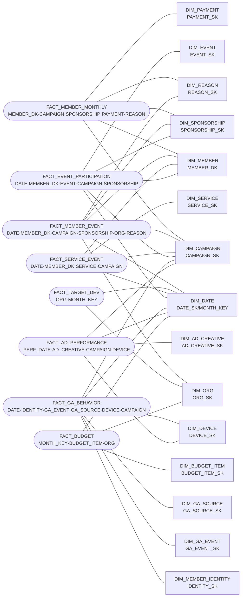
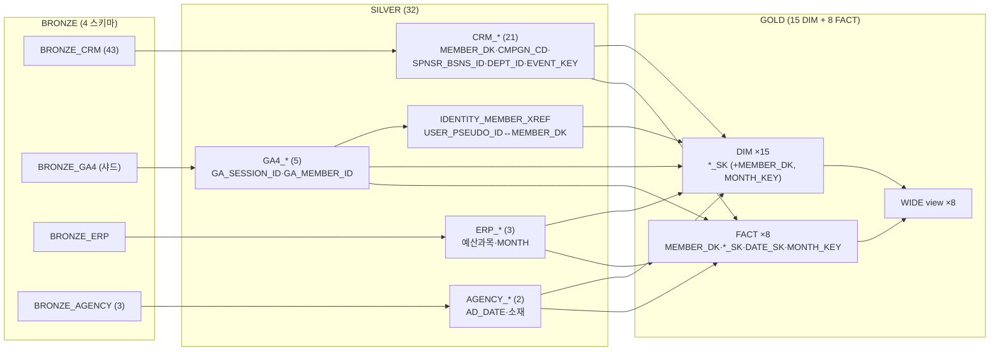

# GN_DW 파이프라인 백본 ERD (Mermaid)

> 테이블명 + 키 컬럼만 표기한 백본 ERD. 상세 컬럼 생략.
> 실측 기준: BRONZE 4스키마 → SILVER 32모델 → GOLD 15 DIM + 8 FACT(+WIDE 8).
> 점선/보류 = 원천 미입고(FACT_TARGET_BIZ, WIDE_TARGET_BIZ — E-6 대기).

---

## 1. 브론즈별 (소스 도메인 레인: 좌 Bronze → 중 Silver → 우 Gold)

```mermaid
flowchart LR
  %% ===== BRONZE (좌) =====
  subgraph BRONZE["BRONZE (원천 1:1)"]
    direction TB
    subgraph B_CRM["BRONZE_CRM (43)"]
      bc_m["회원 마스터<br/>정기/일시<br/>MEMBER_DK"]
      bc_cmp["캠페인/브랜드<br/>CMPGN_CD"]
      bc_spn["후원사업<br/>SPNSR_BSNS_ID"]
      bc_org["부서<br/>DEPT_ID"]
      bc_evt["행사/캠페인행사<br/>EVENT_KEY"]
      bc_snd["발송 요청/상세/성과<br/>SND_REQ_MST"]
      bc_pay["회비/기부/결제수단"]
      bc_code["공통코드<br/>CD_ID+DTL_CD_ID"]
    end
    subgraph B_GA4["BRONZE_GA4"]
      bg["events_YYYYMMDD 샤드<br/>event / user_pseudo_id"]
    end
    subgraph B_ERP["BRONZE_ERP"]
      be["BDGT_ACMSLT_LEDGER<br/>예산과목×월"]
    end
    subgraph B_AGY["BRONZE_AGENCY (3)"]
      ba["DGT / REBRDC / VIDEO<br/>_AD_CMPGN_DTLS"]
    end
  end

  %% ===== SILVER (중) =====
  subgraph SILVER["SILVER (GN_DW.SILVER · 32)"]
    direction TB
    subgraph S_CRM["CRM (21)"]
      sc_m["CRM_MEMBER<br/>MEMBER_DK"]
      sc_hist["CRM_MEMBER_STATUS_HIST"]
      sc_dev["CRM_MEMBER_DEV"]
      sc_amt["CRM_MEMBER_AMT_CHANGE"]
      sc_disc["CRM_MEMBER_DISCONTINUE"]
      sc_resp["CRM_MEMBER_RESPONSOR"]
      sc_sbiz["CRM_MEMBER_SPONSOR_BIZ"]
      sc_cmp["CRM_CAMPAIGN<br/>CMPGN_CD"]
      sc_spn["CRM_SPONSORSHIP<br/>SPNSR_BSNS_ID"]
      sc_org["CRM_ORG<br/>DEPT_ID"]
      sc_tgt["CRM_DEV_TARGET"]
      sc_evt["CRM_EVENT<br/>EVENT_KEY"]
      sc_ep["CRM_EVENT_PARTICIPATION"]
      sc_sreq["CRM_SEND_REQUEST"]
      sc_smem["CRM_SEND_MEMBER"]
      sc_sres["CRM_SEND_RESULT"]
      sc_ract["CRM_RELATION_ACTIVITY"]
      sc_paybi["CRM_PAYMENT_BILLING"]
      sc_paym["CRM_PAYMENT_METHOD"]
      sc_srel["CRM_SPONSOR_RELATION"]
      sc_code["CRM_CODE"]
    end
    subgraph S_GA4["GA4 (5) + 브리지 (1)"]
      sg_evt["GA4_EVENT<br/>GA_SESSION_ID"]
      sg_src["GA4_TRAFFIC_SOURCE<br/>SOURCE_MEDIUM"]
      sg_dim["GA4_EVENT_DIM<br/>CAT×LABEL×ACTION"]
      sg_dev["GA4_DEVICE"]
      sg_id["GA4_IDENTITY<br/>GA_MEMBER_ID"]
      sg_xref["IDENTITY_MEMBER_XREF<br/>USER_PSEUDO_ID↔MEMBER_DK"]
    end
    subgraph S_ERP["ERP (3)"]
      se_item["ERP_BUDGET_ITEM"]
      se_bd["ERP_BUDGET"]
      se_biz["ERP_BIZ_TARGET (schema-only)"]
    end
    subgraph S_AGY["AGENCY (2)"]
      sa_cr["AGENCY_AD_CREATIVE"]
      sa_perf["AGENCY_AD_PERFORMANCE<br/>AD_DATE"]
    end
  end

  %% ===== GOLD (우) =====
  subgraph GOLD["GOLD (GN_DW.GOLD · 15 DIM + 8 FACT)"]
    direction TB
    subgraph G_DIM["DIM"]
      d_mem["DIM_MEMBER<br/>MEMBER_SK / MEMBER_DK"]
      d_id["DIM_MEMBER_IDENTITY<br/>IDENTITY_SK"]
      d_cmp["DIM_CAMPAIGN<br/>CAMPAIGN_SK"]
      d_spn["DIM_SPONSORSHIP<br/>SPONSORSHIP_SK"]
      d_org["DIM_ORG<br/>ORG_SK"]
      d_svc["DIM_SERVICE<br/>SERVICE_SK"]
      d_pay["DIM_PAYMENT<br/>PAYMENT_SK"]
      d_rsn["DIM_REASON<br/>REASON_SK"]
      d_evt["DIM_EVENT<br/>EVENT_SK"]
      d_date["DIM_DATE<br/>DATE_SK / MONTH_KEY"]
      d_gsrc["DIM_GA_SOURCE<br/>GA_SOURCE_SK"]
      d_gevt["DIM_GA_EVENT<br/>GA_EVENT_SK"]
      d_dev["DIM_DEVICE<br/>DEVICE_SK"]
      d_ad["DIM_AD_CREATIVE<br/>AD_CREATIVE_SK"]
      d_bi["DIM_BUDGET_ITEM<br/>BUDGET_ITEM_SK"]
    end
    subgraph G_FACT["FACT"]
      f_fmm["FACT_MEMBER_MONTHLY<br/>MEMBER_DK×MONTH"]
      f_fme["FACT_MEMBER_EVENT"]
      f_ftd["FACT_TARGET_DEV"]
      f_fse["FACT_SERVICE_EVENT"]
      f_fga["FACT_GA_BEHAVIOR"]
      f_fad["FACT_AD_PERFORMANCE"]
      f_fep["FACT_EVENT_PARTICIPATION"]
      f_fbd["FACT_BUDGET"]
      f_ftb["FACT_TARGET_BIZ (보류)"]:::pending
    end
  end

  %% ===== Bronze → Silver =====
  bc_m --> sc_m
  bc_cmp --> sc_cmp
  bc_spn --> sc_spn
  bc_org --> sc_org
  bc_evt --> sc_evt & sc_ep
  bc_snd --> sc_sreq & sc_smem & sc_sres
  bc_pay --> sc_paybi & sc_paym
  bc_code --> sc_code
  bg --> sg_evt & sg_src & sg_dim & sg_dev & sg_id
  be --> se_item & se_bd
  ba --> sa_cr & sa_perf

  %% ===== Silver → Gold (백본만) =====
  sc_m --> d_mem & d_id
  sc_cmp --> d_cmp
  sc_spn --> d_spn
  sc_org --> d_org
  sc_paym --> d_pay
  sc_disc --> d_rsn
  sc_evt --> d_evt
  sc_sreq --> d_svc
  sg_src --> d_gsrc
  sg_dim --> d_gevt
  sg_dev --> d_dev
  sg_id --> sg_xref --> d_id
  sa_cr --> d_ad
  se_item --> d_bi

  sc_dev & sc_amt & sc_hist & sc_resp & sc_sbiz & sc_paybi --> f_fmm
  sc_dev & sc_disc --> f_fme
  sc_tgt --> f_ftd
  sc_sreq & sc_smem & sc_sres & sc_ract --> f_fse
  sc_ep --> f_fep
  sg_evt --> f_fga & f_fad
  sa_perf --> f_fad
  se_bd --> f_fbd
  se_biz -.-> f_ftb

  classDef pending stroke-dasharray:4 3,stroke:#999,color:#999;
```

---

## 2. gold별 (스타 스키마 백본: FACT ↔ 공유 DIM)

---

## 3. 단일 통합 (좌 Bronze · 중 Silver · 우 Gold — 스키마 3열)

