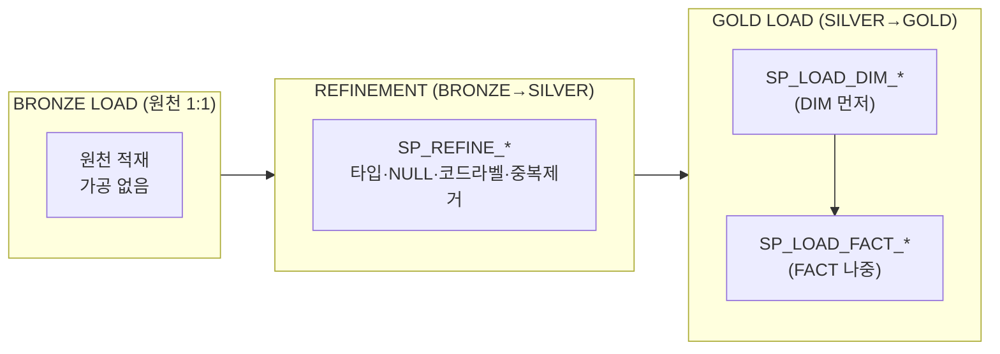
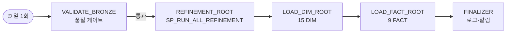

# GN_DW ETL 프로시저 설계 (BRONZE → SILVER → GOLD)

> **목적**: 메달리온 적재 파이프라인의 **프로시저(SP)·태스크(DAG) 설계 골격**. 구축 주체가 이 설계를 기반으로 실제 SP/TASK를 구현한다(세부 구현·튜닝은 구축 단계에서 조정 가능).
> **권위 소스**: 컬럼 단위 매핑은 `03_top-down_gold/GOLD_SILVER 의존.md`, 정제 규칙은 `04_silver_design/SILVER_설계_작업 계획.md`, 대상 구조는 `03_top-down_gold/GOLD_ddl 초안.sql`(12 DIM + 6 FACT). 본 문서는 이들을 **변환 로직으로 잇는 절차 설계**.
> **범위**: BRONZE→SILVER 정제 SP, SILVER→GOLD 적재 SP, 오케스트레이션 DAG. 실제 컬럼 목록은 중복 기재하지 않고 권위 소스를 참조.

---

## 0. 설계 원칙

| ID | 원칙 | 내용 |
|---|---|---|
| SP1 | 멱등성 | 모든 적재는 `MERGE`(또는 truncate+insert) 기반. 재실행해도 결과 동일 |
| SP2 | 단방향 | BRONZE→SILVER→GOLD. 역참조·계층 건너뛰기 금지 |
| SP3 | 원자 단위 | SP 1개 = 대상 테이블 1개. 의존성은 DAG가 관리 |
| SP4 | 적재 순서 | GOLD는 **DIM 먼저 → FACT 나중**(FK 무결성·SK 조회 보장) |
| SP5 | 로깅 | 모든 SP는 시작/종료/행수/오류를 `OPS` 로그 테이블에 기록 |
| SP6 | 파라미터화 | 증분 윈도(`P_FROM_DT`/`P_TO_DT`) 파라미터. 미지정 시 전량 |

---

## 1. 파이프라인 전체 흐름



---

## 2. BRONZE → SILVER 정제 SP

### 2-1. 명명·구조
- 명명: `SP_REFINE_<SILVER_테이블명>` (예: `SP_REFINE_CRM_MEMBER_MASTER`)
- 원천 테이블(또는 동일 소스 내 JOIN 묶음) 1조 → SILVER 테이블 1개
- 대상 SILVER 테이블·정제 규칙: `SILVER_설계_작업 계획.md`(1절 전수목록·2절 통합트리) 기준

### 2-2. 표준 정제 단계 (각 SP 내부)
```
1. 타입 캐스팅      원천 문자열 → 정합 타입(DATE/NUMBER/BOOLEAN)
2. NULL 표준화      빈문자/'-'/9999 등 → NULL 통일
3. 코드 → 라벨      코드값 보존 + 라벨 컬럼 병행 생성(TC_CMMN_CD 조인)
4. 중복 제거        PK 기준 dedup(QUALIFY ROW_NUMBER() … = 1)
5. 동일 소스 JOIN   같은 소스 내 결합만(타 소스·집계는 GOLD에서)
6. MERGE 적재       SILVER 테이블에 PK 기준 UPSERT
```

### 2-3. 패턴 예시 (대표 1개)
```sql
CREATE OR REPLACE PROCEDURE GN_DW.SILVER.SP_REFINE_CRM_MEMBER_MASTER()
RETURNS STRING LANGUAGE SQL AS
$$
BEGIN
  MERGE INTO GN_DW.SILVER.CRM_MEMBER_MASTER tgt
  USING (
    SELECT
      CAST(MBER_NO AS STRING)              AS MEMBER_NO,      -- 키 보존
      NULLIF(TRIM(MBER_NM), '')            AS MEMBER_NM,      -- NULL 표준화
      TRY_TO_DATE(RGST_DT, 'YYYYMMDD')     AS REG_DT,         -- 타입 캐스팅
      c.CD_NM                              AS MEMBER_STATUS_LABEL, -- 코드→라벨
      STNG_STTUS_CD                        AS MEMBER_STATUS_CD
    FROM GN_DW.BRONZE.CRM_TM_MM_FDRM_MBER_BASE b
    LEFT JOIN GN_DW.BRONZE.CRM_TC_CMMN_CD c
      ON c.CD_GRP = 'MM_STATUS' AND c.CD = b.STNG_STTUS_CD
    QUALIFY ROW_NUMBER() OVER (PARTITION BY MBER_NO ORDER BY CHG_DTM DESC) = 1  -- 중복 제거
  ) src
  ON tgt.MEMBER_NO = src.MEMBER_NO
  WHEN MATCHED THEN UPDATE SET …
  WHEN NOT MATCHED THEN INSERT …;
  RETURN 'OK';
END;
$$;
```
> 컬럼명·원천 테이블명은 **예시**입니다. 실제 매핑은 `GOLD_SILVER 의존.md` §2-1 및 `S1_CRM_entity_design/`를 따르세요.

### 2-4. 일괄 실행 루트
- `SP_RUN_ALL_REFINEMENT()` — 소스 prefix 순서로 개별 `SP_REFINE_*` 호출.
- 신규 원천/CRM 확장분은 이 루트에 **호출 한 줄 추가**로 확장(원천별 모듈화).

---

## 3. SILVER → GOLD 적재 SP

### 3-1. DIM 적재 (`SP_LOAD_DIM_*`) — **먼저 실행**
- 12개 DIM 각각 1 SP. SK(서로게이트 키) 생성·BK(비즈니스 키) 매핑.
- SCD 처리: `GOLD_차원 설계.md`의 DIM별 SCD 유형(Type 1/2) 준수.
- `DIM_DATE`는 시드성(달력 생성) — 1회 또는 범위 확장 시만.

```sql
-- 패턴: BK→SK 매핑 + SCD2 이력
MERGE INTO GN_DW.GOLD.DIM_MEMBER tgt
USING ( SELECT … FROM GN_DW.SILVER.CRM_MEMBER_MASTER ) src
ON tgt.MEMBER_BK = src.MEMBER_NO AND tgt.IS_CURRENT = TRUE
WHEN MATCHED AND (속성 변경) THEN UPDATE SET IS_CURRENT=FALSE, END_DT=CURRENT_DATE  -- 이력 마감
WHEN NOT MATCHED THEN INSERT ( … , IS_CURRENT, START_DT );                         -- 신규 버전
```

### 3-2. FACT 적재 (`SP_LOAD_FACT_*`) — **DIM 이후**
- 6개 FACT 각각 1 SP. SILVER 정제본을 grain에 맞춰 **집계(GROUP BY)** + DIM SK 조회.
- grain·measure·가산성: `GOLD_팩트 설계.md`. 분모/분자 base measure: `GOLD_파생지표 매핑.md`.
- degenerate dimension·measure 컬럼은 `GOLD_ddl 초안.sql` 정의 그대로.

```sql
-- 패턴: SILVER 집계 + DIM SK 조회 후 FACT MERGE
MERGE INTO GN_DW.GOLD.FACT_MEMBER_MONTHLY tgt
USING (
  SELECT d.DATE_SK, m.MEMBER_SK, o.ORG_SK,
         SUM(s.AMT) AS PAYMENT_AMT, COUNT(*) AS PAYMENT_CNT
  FROM GN_DW.SILVER.CRM_PAYMENT s
  JOIN GN_DW.GOLD.DIM_DATE   d ON d.DATE = s.PAY_DT
  JOIN GN_DW.GOLD.DIM_MEMBER m ON m.MEMBER_BK = s.MEMBER_NO AND m.IS_CURRENT
  JOIN GN_DW.GOLD.DIM_ORG    o ON o.ORG_BK = s.DEPT_ID
  GROUP BY d.DATE_SK, m.MEMBER_SK, o.ORG_SK
) src
ON ( tgt grain 키 일치 )
WHEN MATCHED THEN UPDATE SET … WHEN NOT MATCHED THEN INSERT …;
```

### 3-3. FACT별 원천 의존 (적재 가능 시점)
| FACT | 주 SILVER 소스 | 즉시 가능 |
|---|---|---|
| FACT_MEMBER_MONTHLY (FMM) | CRM | ✅ |
| FACT_TARGET_DEV / BIZ (FTG) | CRM | ✅ |
| FACT_SERVICE_EVENT (FSE) | CRM (+ ADMIN 보강) | ⚠️ CRM분만 |
| FACT_GA_BEHAVIOR (FGA) | GA4 | ⏳ 입고 후 |
| FACT_AD_PERFORMANCE (FAD) | AGENCY (+ GADS 보강) | ⏳ 입고 후 |

> GADS·ADMIN은 통합 원천(AGENCY/CRM) 결정 후 소스 경로 확정 → FAD/FSE 보강분 적재.

---

## 4. 오케스트레이션 DAG



- 루트 `TASK_VALIDATE_BRONZE` → `TASK_REFINEMENT_ROOT` → `TASK_LOAD_DIM` → `TASK_LOAD_FACT` → `TASK_FINALIZER`.
- **DIM 완료 후 FACT 시작**(SP4). FACT 태스크는 DIM 태스크를 AFTER로 의존.
- 실행 모드: Serverless 권장(자동 스케일, 3회 연속 실패 시 자동 중단).
- 상세 DAG·테스트·모니터링은 `02_GN_DW_building/04_운영.md` 참조(태스크 골격 정본).

---

## 5. 오류·운영 처리

| 항목 | 설계 |
|---|---|
| 품질 게이트 | `VALIDATE_BRONZE`에서 행수·NULL률·키 유일성 임계 검사 → 위반 시 후속 차단 |
| 재처리 | 증분 파라미터(`P_FROM_DT`/`P_TO_DT`)로 특정 구간만 재적재 |
| 멱등성 | MERGE 기반이라 동일 구간 재실행 안전 |
| 로깅 | SP별 시작/종료/행수/오류코드를 OPS 로그에 적재(SP5) |
| 알림 | FINALIZER에서 실패·지연 알림 발송 |

---

## 6. 미결정 / 구축 단계 확정 항목 (OPEN)

- **GADS·ADMIN 통합 목적지**(AGENCY/CRM) 미정 → FAD/FSE 보강 SP의 SILVER 소스 경로 미확정.
- **CRM 테이블 확장 가능** → `SP_REFINE_CRM_*` 모듈 추가 방식으로 흡수(고정 가정 금지).
- 증분 vs 전량 적재 주기, 품질 임계값, SCD2 적용 DIM 범위는 구축 단계에서 데이터 실측 후 확정.
- 컬럼 단위 정합 추적은 항상 `GOLD_SILVER 의존.md`를 정본으로 사용.
