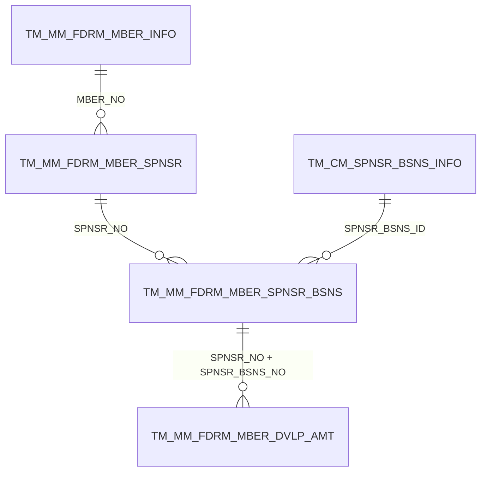
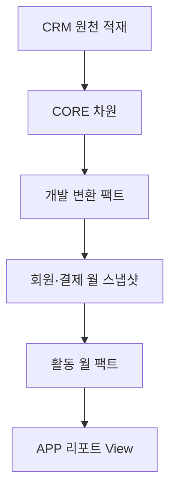
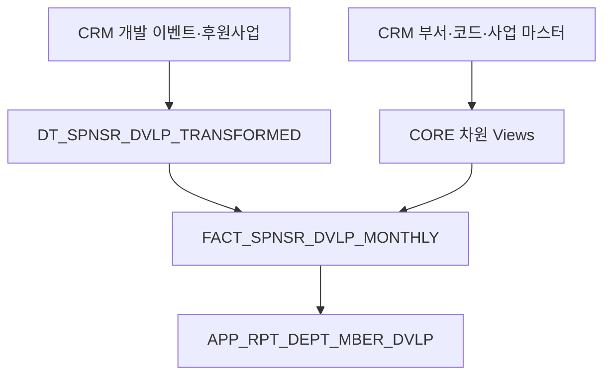
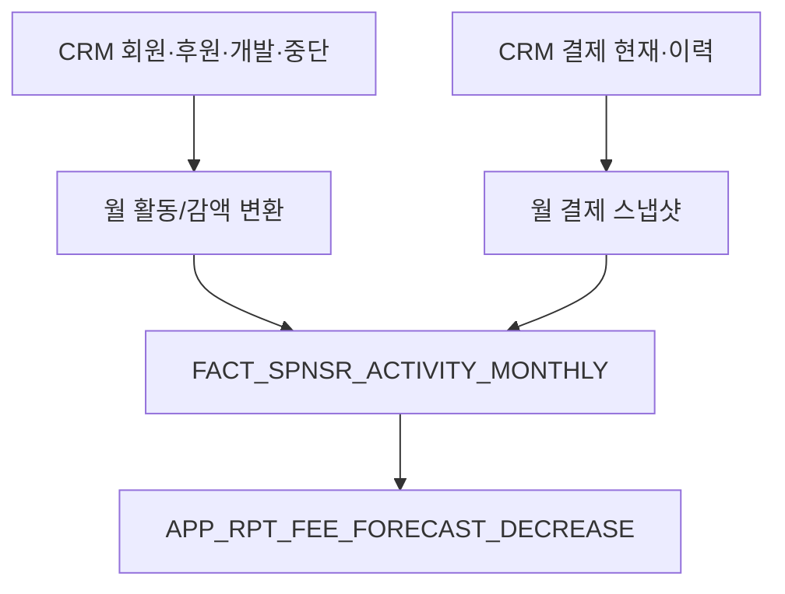

# Snowflake CoCo용 MSTR_DW 가상 구조·CRM 물리 구조 참조 문서

- 작성 기준일: 2026-08-20
- 함께 사용할 문서: `snowflake_coco_mstr_dw_reference.md`
- 대상 환경: Snowflake에는 CRM/MSTR_ODS 계열 원천 테이블만 적재되어 있고 `MSTR_DW.MART` 테이블·함수·프로시저·View는 존재하지 않음
- 문서 목적: CoCo가 존재하지 않는 MSTR_DW 오브젝트를 조회하려 하지 않고, CRM 물리 테이블로 필요한 논리 구조를 재구성하도록 지원

---

## 1. 가장 중요한 전제

### 1.1 Snowflake에 실제로 존재하는 것

- CRM 기준 원천 테이블
- 테이블명은 MS SQL의 `MSTR_ODS.dbo.*`와 같거나 유사할 수 있음
- 실제 Snowflake Database/Schema 이름은 별도 확인 필요

### 1.2 Snowflake에 존재하지 않는 것

다음 이름은 기존 MSTR_DW의 논리 참조명이다. Snowflake SQL에서 그대로 조회하면 안 된다.

- `MSTR_DW.MART.F_MM_SPNSR_DVLP`
- `MSTR_DW.MART.F_MM_SPNSR_DVLP_SUM`
- `MSTR_DW.MART.F_MM_SPNSR_ACT`
- `MSTR_DW.MART.D_*`
- `MSTR_DW.dbo.FN_*`
- `MSTR_DW.MART.USP_*`

### 1.3 CoCo의 처리 방식

```text
잘못된 방식
  SELECT * FROM MSTR_DW.MART.F_MM_SPNSR_DVLP_SUM

올바른 방식
  1. CRM 원천 테이블의 실제 위치를 찾는다.
  2. 이 문서의 가상 오브젝트 정의를 사용해 CORE/MART View를 생성한다.
  3. Streamlit은 새로 만든 APP View를 조회한다.
```

MSTR_DW의 프로시저는 호출 대상이 아니라, CRM 원천을 어떤 순서와 규칙으로 변환했는지 설명하는 ETL 명세다.

---

## 2. 두 문서의 역할 구분

| 문서 | 역할 |
|---|---|
| `snowflake_coco_mstr_dw_reference.md` | 업무 의미, 계산식, 검증값, Snowflake/Streamlit 구현 원칙 |
| `snowflake_coco_mstr_virtual_structure_reference.md` | CRM 실제 테이블 구조, MSTR_DW 가상 스키마, 오브젝트 간 의존성, 대체 View 구조 |

CoCo는 반드시 두 문서를 함께 읽어야 한다.

---

## 3. 오브젝트 상태 표기

| 상태 | 의미 |
|---|---|
| `PHYSICAL_CONFIRMED` | CRM 실제 테이블명과 컬럼 구조가 제공됨 |
| `PHYSICAL_PARTIAL` | CRM 테이블명과 필요한 일부 컬럼만 SQL에서 확인됨 |
| `LEGACY_VIRTUAL` | 기존 MSTR_DW에 존재했으나 현재 Snowflake에는 없음 |
| `TARGET_REQUIRED` | Snowflake에서 새 View/Dynamic Table/Table로 생성해야 함 |
| `REFERENCE_ONLY` | 현재 두 리포트에는 직접 필요하지 않은 확장 오브젝트 |

---

## 4. Snowflake 실제 CRM 오브젝트 자동 확인 SQL

CoCo는 구현 전에 다음 SQL의 Database와 Schema를 실제 환경에 맞게 바꾸어 실행해야 한다.

```sql
SELECT
    TABLE_CATALOG,
    TABLE_SCHEMA,
    TABLE_NAME,
    ORDINAL_POSITION,
    COLUMN_NAME,
    DATA_TYPE,
    CHARACTER_MAXIMUM_LENGTH,
    NUMERIC_PRECISION,
    NUMERIC_SCALE,
    IS_NULLABLE
FROM <CRM_DATABASE>.INFORMATION_SCHEMA.COLUMNS
WHERE UPPER(TABLE_NAME) IN
(
    'TC_CMMN_CD',
    'TC_CMMN_DTL_CD',
    'TM_CM_DEPT_INFO',
    'TM_CM_SPNSR_BSNS_INFO',
    'TM_MM_FDRM_MBER_DVLP_AMT',
    'TM_MM_FDRM_MBER_INFO',
    'TM_MM_FDRM_MBER_SPNSR',
    'TM_MM_FDRM_MBER_SPNSR_BSNS',
    'TM_MM_FDRM_MBER_SPNSR_DSCNTC',
    'TM_MM_FDRM_MBER_RE_SPNSR',
    'TM_PM_SETLE_INFO',
    'TH_PM_SETLE_INFO_HIST',
    'TH_MM_FDRM_MBER_STNG_DTLS',
    'TM_PM_MBRFEE_ACMSLT',
    'TM_PM_MBRFEE_UNSLCTED'
)
ORDER BY TABLE_SCHEMA, TABLE_NAME, ORDINAL_POSITION;
```

### 4.1 실제 위치 매핑표

CoCo는 구현을 시작하기 전에 다음 표를 채워야 한다.

| 논리 CRM 테이블 | Snowflake 실제 FQN | 확인 상태 |
|---|---|---|
| `dbo.TC_CMMN_CD` | `<DB>.<SCHEMA>.TC_CMMN_CD` | 미확인 |
| `dbo.TC_CMMN_DTL_CD` | `<DB>.<SCHEMA>.TC_CMMN_DTL_CD` | 미확인 |
| `dbo.TM_CM_DEPT_INFO` | `<DB>.<SCHEMA>.TM_CM_DEPT_INFO` | 미확인 |
| `dbo.TM_CM_SPNSR_BSNS_INFO` | `<DB>.<SCHEMA>.TM_CM_SPNSR_BSNS_INFO` | 미확인 |
| `dbo.TM_MM_FDRM_MBER_DVLP_AMT` | `<DB>.<SCHEMA>.TM_MM_FDRM_MBER_DVLP_AMT` | 미확인 |
| `dbo.TM_MM_FDRM_MBER_INFO` | `<DB>.<SCHEMA>.TM_MM_FDRM_MBER_INFO` | 미확인 |
| `dbo.TM_MM_FDRM_MBER_SPNSR` | `<DB>.<SCHEMA>.TM_MM_FDRM_MBER_SPNSR` | 미확인 |
| `dbo.TM_MM_FDRM_MBER_SPNSR_BSNS` | `<DB>.<SCHEMA>.TM_MM_FDRM_MBER_SPNSR_BSNS` | 미확인 |

---

## 5. CRM 물리 테이블 상세 구조 — 확인 완료

아래 구조는 제공된 MS SQL 메타데이터 기준이다. Snowflake 적재 과정에서 타입이 변환됐을 수 있으므로 컬럼명과 의미의 기준으로 사용한다.

### 5.1 `dbo.TC_CMMN_CD`

- 상태: `PHYSICAL_CONFIRMED`
- Grain: 공통코드 그룹 1행
- 논리 PK: `CD_ID`

| 순번 | 컬럼 | MS SQL 타입 | NULL | 의미 |
|---:|---|---|---|---|
| 1 | `CD_ID` | `varchar(20)` | N | 공통코드 그룹 ID |
| 2 | `CD_NM` | `varchar(100)` | Y | 코드명 |
| 3 | `CD_DC` | `varchar(500)` | Y | 설명 |
| 4 | `SORT_ORDR` | `int` | Y | 정렬순서 |
| 5 | `RM` | `varchar(1000)` | Y | 비고 |
| 6 | `USE_YN` | `char(1)` | Y | 사용여부 |
| 7 | `FRST_RGSTR_ID` | `varchar(30)` | Y | 최초등록자 |
| 8 | `FRST_REGIST_DT` | `datetime` | Y | 최초등록일시 |
| 9 | `LAST_UPDUSR_ID` | `varchar(30)` | Y | 최종수정자 |
| 10 | `LAST_UPDT_DT` | `datetime` | Y | 최종수정일시 |

### 5.2 `dbo.TC_CMMN_DTL_CD`

- 상태: `PHYSICAL_CONFIRMED`
- Grain: 코드그룹별 상세코드 1행
- 논리 PK: `CD_ID + DTL_CD_ID`

| 순번 | 컬럼 | MS SQL 타입 | NULL | 의미 |
|---:|---|---|---|---|
| 1 | `CD_ID` | `varchar(20)` | N | 코드그룹 ID |
| 2 | `DTL_CD_ID` | `varchar(50)` | N | 상세코드 ID |
| 3 | `DTL_CD_NM` | `varchar(100)` | Y | 상세코드명 |
| 4 | `DTL_CD_DC` | `varchar(500)` | Y | 설명 |
| 5 | `SORT_ORDR` | `int` | Y | 정렬순서 |
| 6 | `RM` | `varchar(1000)` | Y | 비고 |
| 7 | `USE_YN` | `char(1)` | Y | 사용여부 |
| 8 | `CD_ATRB1` | `varchar(100)` | Y | 코드속성1 |
| 9 | `CD_ATRB2` | `varchar(100)` | Y | 코드속성2 |
| 10 | `CD_ATRB3` | `varchar(100)` | Y | 코드속성3 |
| 11 | `FRST_RGSTR_ID` | `varchar(30)` | Y | 최초등록자 |
| 12 | `FRST_REGIST_DT` | `datetime` | Y | 최초등록일시 |
| 13 | `LAST_UPDUSR_ID` | `varchar(30)` | Y | 최종수정자 |
| 14 | `LAST_UPDT_DT` | `datetime` | Y | 최종수정일시 |
| 15 | `UPPER_CD_ID` | `varchar(20)` | Y | 상위 코드그룹 |

### 5.3 `dbo.TM_CM_DEPT_INFO`

- 상태: `PHYSICAL_CONFIRMED`
- Grain: 부서 1행
- 논리 PK: `DEPT_ID`
- 핵심 관계: `ACMSLT_UPPER_DEPT_ID → DEPT_ID` self join

| 순번 | 컬럼 | MS SQL 타입 | NULL | 의미 |
|---:|---|---|---|---|
| 1 | `DEPT_ID` | `varchar(20)` | N | 부서 ID |
| 2 | `DEPT_NM` | `varchar(50)` | Y | 부서명 |
| 3 | `UPPER_DEPT_ID` | `varchar(20)` | Y | 조직상 상위부서 |
| 4 | `SORT_ORDR` | `int` | Y | 정렬순서 |
| 5 | `USE_YN` | `char(1)` | Y | 사용여부 |
| 6 | `ACMSLT_DEPT_YN` | `char(1)` | Y | 실적부서 여부 |
| 7 | `STATS_DEPT_LVL` | `tinyint` | Y | 통계부서 레벨 |
| 8 | `FRST_RGSTR_ID` | `varchar(30)` | Y | 최초등록자 |
| 9 | `FRST_REGIST_DT` | `datetime` | Y | 최초등록일시 |
| 10 | `LAST_UPDUSR_ID` | `varchar(30)` | Y | 최종수정자 |
| 11 | `LAST_UPDT_DT` | `datetime` | Y | 최종수정일시 |
| 12 | `ACMSLT_UPPER_DEPT_ID` | `varchar(20)` | Y | 실적기준 상위부서 |

### 5.4 `dbo.TM_CM_SPNSR_BSNS_INFO`

- 상태: `PHYSICAL_CONFIRMED`
- Grain: 후원사업 1행
- 논리 PK: `SPNSR_BSNS_ID`

| 순번 | 컬럼 | MS SQL 타입 | NULL | 의미 |
|---:|---|---|---|---|
| 1 | `SPNSR_BSNS_ID` | `varchar(20)` | N | 후원사업 ID |
| 2 | `SPNSR_DIV_CD` | `varchar(3)` | Y | 후원구분 |
| 3 | `SPNSR_BSNS_NM` | `varchar(50)` | Y | 후원사업명 |
| 4 | `SPNSR_BSNS_ABRV_CD` | `varchar(3)` | Y | 후원사업약칭 코드 |
| 5 | `DNTN_TY_CD` | `varchar(3)` | Y | 기부금 유형 |
| 6 | `SORT_ORDR` | `int` | Y | 정렬순서 |
| 7 | `CPR_DIV_CD` | `varchar(3)` | Y | 법인구분 |
| 8 | `RM` | `varchar(1000)` | Y | 비고 |
| 9 | `USE_YN` | `char(1)` | Y | 사용여부 |
| 10 | `FRST_RGSTR_ID` | `varchar(30)` | Y | 최초등록자 |
| 11 | `FRST_REGIST_DT` | `datetime` | Y | 최초등록일시 |
| 12 | `LAST_UPDUSR_ID` | `varchar(30)` | Y | 최종수정자 |
| 13 | `LAST_UPDT_DT` | `datetime` | Y | 최종수정일시 |

### 5.5 `dbo.TM_MM_FDRM_MBER_DVLP_AMT`

- 상태: `PHYSICAL_CONFIRMED`
- Grain: 후원 개발/변경 이벤트 1행
- 논리 PK: `SPNSR_NO + SPNSR_BSNS_NO + OCCRRNC_DE + SER_NO`
- 가장 중요한 원천 팩트

| 순번 | 컬럼 | MS SQL 타입 | NULL | 의미 |
|---:|---|---|---|---|
| 1 | `SPNSR_NO` | `varchar(9)` | N | 후원번호 |
| 2 | `SPNSR_BSNS_NO` | `bigint` | N | 후원사업번호 |
| 3 | `OCCRRNC_DE` | `varchar(8)` | N | 발생일 `YYYYMMDD` |
| 4 | `SER_NO` | `int` | N | 발생 순번 |
| 5 | `MBER_NO` | `varchar(10)` | Y | 회원번호 |
| 6 | `ACT_DEPT_CD` | `varchar(10)` | Y | 활동부서 |
| 7 | `ACMSLT_DEPT_CD` | `varchar(10)` | Y | 실적부서 |
| 8 | `CMPGN_CD` | `varchar(20)` | Y | 캠페인 |
| 9 | `SETLE_CD` | `varchar(3)` | Y | 결제코드 |
| 10 | `MBER_DIV_CD` | `varchar(3)` | Y | 회원구분 |
| 11 | `SEX` | `varchar(2)` | Y | 성별 |
| 12 | `AREA_CD` | `varchar(3)` | Y | 지역 |
| 13 | `AGE` | `int` | Y | 연령/연령코드 |
| 14 | `SPNSR_TIME_CO` | `int` | Y | 후원시간 수 |
| 15 | `SPNSR_AMT_CD` | `varchar(3)` | Y | 후원금액 코드 |
| 16 | `SPNSR_BSNS_ID` | `varchar(20)` | Y | 후원사업 ID |
| 17 | `CANCL_RDCAMT_RSN_CD` | `varchar(3)` | Y | 취소/감액 사유 |
| 18 | `SPNSR_AMT` | `bigint` | Y | 증감 금액 |
| 19 | `DVLP_DIV_CD` | `varchar(3)` | Y | 개발구분 1~5 |
| 20 | `FRST_RGSTR_ID` | `varchar(30)` | Y | 최초등록자 |
| 21 | `FRST_RGSTR_NM` | `varchar(100)` | Y | 최초등록자명 |

### 5.6 `dbo.TM_MM_FDRM_MBER_INFO`

- 상태: `PHYSICAL_CONFIRMED`
- Grain: 회원 1행
- 논리 PK: `MBER_NO`
- 개인정보가 포함되어 있으므로 앱에서 직접 노출 금지

| 순번 | 컬럼 | MS SQL 타입 | NULL | 사용/주의 |
|---:|---|---|---|---|
| 1 | `MBER_NO` | `varchar(10)` | N | 회원 키 |
| 2 | `MBER_DIV_CD` | `varchar(3)` | Y | 회원구분 |
| 3 | `CPR_DIV_CD` | `varchar(3)` | Y | 법인구분 |
| 4 | `RRN_FSTDGT` | `varchar(6)` | Y | 민감정보, 앱 사용 금지 |
| 5 | `RRN_LSTDGT_ENC` | `varbinary(128)` | Y | 민감정보, 앱 사용 금지 |
| 6 | `BRTHDY` | `varchar(8)` | Y | 생년월일, 직접 노출 금지 |
| 7 | `SLRCLD_LRR_CD` | `varchar(3)` | Y | 양력/음력 |
| 8 | `MBER_KORNM` | `varchar(50)` | Y | 성명, 앱 사용 금지 |
| 9 | `MBER_ENGNM` | `varchar(50)` | Y | 영문명, 앱 사용 금지 |
| 10 | `MBTLNUM` | `varchar(20)` | Y | 연락처, 앱 사용 금지 |
| 11 | `MOBLPHON_STAT_CD` | `varchar(3)` | Y | 휴대전화 상태 |
| 12 | `TSTM_DIV_CD` | `int` | Y | 동의/상태 코드 |
| 13 | `ETC_CTTPC` | `varchar(14)` | Y | 기타 연락처 |
| 14 | `ETC_TSTM_DIV_CD` | `int` | Y | 기타 동의구분 |
| 15 | `ETC_CTTPC_REL_CD` | `varchar(3)` | Y | 연락처 관계 |
| 16 | `ETC_CTTPC_STAT_CD` | `varchar(3)` | Y | 연락처 상태 |
| 17 | `FAXNO` | `varchar(14)` | Y | 팩스 |
| 18 | `ZIP` | `varchar(7)` | Y | 우편번호 |
| 19 | `ADDR` | `varchar(200)` | Y | 주소, 앱 사용 금지 |
| 20 | `DTL_ADDR` | `varchar(200)` | Y | 상세주소, 앱 사용 금지 |
| 21 | `EMAIL` | `varchar(50)` | Y | 이메일, 앱 사용 금지 |
| 22 | `EMAIL_STAT_CD` | `varchar(3)` | Y | 이메일 상태 |
| 23 | `PSTMTR_RECPTN_CD` | `varchar(100)` | Y | 우편 수신 |
| 24 | `EMAIL_RECPTN_CD` | `varchar(100)` | Y | 이메일 수신 |
| 25 | `CHRCTR_RECPTN_YN` | `char(1)` | Y | 문자 수신 |
| 26 | `BL_ENTRPS_NO` | `bigint` | Y | 기업번호 |
| 27 | `SPECL_MNG_CD1` | `varchar(3)` | Y | 특별관리1 |
| 28 | `SPECL_MNG_CD2` | `varchar(3)` | Y | 특별관리2 |
| 29 | `TNI_CU_BL_NO` | `bigint` | Y | 별도 관리번호 |
| 30 | `CMPGN_CD` | `varchar(20)` | Y | 캠페인 |
| 31 | `MBER_STAT_CD` | `varchar(3)` | Y | 회원상태 |
| 32 | `RELATNSP_DIV_CD` | `varchar(3)` | Y | 결연구분 |
| 33 | `ACT_DEPT_CD` | `varchar(10)` | Y | 활동부서 |
| 34 | `HMPG_ID` | `varchar(30)` | Y | 홈페이지 ID |
| 35 | `JOIN_PATH_CD` | `varchar(3)` | Y | 가입경로 |
| 36 | `CTI_SYNCHRN_DIV_CD` | `varchar(3)` | Y | CTI 동기화 |
| 37 | `STDR_DE` | `date` | Y | 기준일 |
| 38 | `FRST_REGIST_DT` | `datetime` | Y | 최초등록일시 |
| 39 | `REGIST_DEPT_CD` | `varchar(10)` | Y | 등록부서 |
| 40 | `FRST_RGSTR_ID` | `varchar(30)` | Y | 최초등록자 |
| 41 | `SEX` | `varchar(2)` | Y | 성별 |

### 5.7 `dbo.TM_MM_FDRM_MBER_SPNSR`

- 상태: `PHYSICAL_CONFIRMED`
- Grain: 후원번호 1행
- 논리 PK: `SPNSR_NO`

| 순번 | 컬럼 | MS SQL 타입 | NULL | 의미 |
|---:|---|---|---|---|
| 1 | `SPNSR_NO` | `varchar(9)` | N | 후원번호 |
| 2 | `MBER_NO` | `varchar(10)` | Y | 회원번호 |
| 3 | `CMPGN_CD` | `varchar(20)` | Y | 캠페인 |
| 4 | `ACMSLT_DEPT_CD` | `varchar(10)` | Y | 실적부서 |
| 5 | `JOIN_PATH_CD` | `varchar(3)` | Y | 가입경로 |
| 6 | `FRST_RGSTR_ID` | `varchar(30)` | Y | 최초등록자 |
| 7 | `FRST_REGIST_DT` | `datetime` | Y | 후원 최초등록일 |

### 5.8 `dbo.TM_MM_FDRM_MBER_SPNSR_BSNS`

- 상태: `PHYSICAL_CONFIRMED`
- Grain: 후원번호별 후원사업 1행
- 논리 PK: `SPNSR_NO + SPNSR_BSNS_NO`

| 순번 | 컬럼 | MS SQL 타입 | NULL | 의미 |
|---:|---|---|---|---|
| 1 | `SPNSR_NO` | `varchar(9)` | N | 후원번호 |
| 2 | `SPNSR_BSNS_NO` | `bigint` | N | 후원사업번호 |
| 3 | `SPNSR_BSNS_ID` | `varchar(20)` | Y | 후원사업 ID |
| 4 | `SPNSR_AMT` | `bigint` | Y | 현재 후원금액 |
| 5 | `SPNSR_DSCNTC_DE` | `varchar(8)` | Y | 후원 중단일 |
| 6 | `SPNSR_DSCNTC_YN` | `char(1)` | Y | 중단여부 |
| 7 | `SPNSR_DSCNTC_RSN_CD` | `varchar(3)` | Y | 중단사유 |

---

## 6. CRM 물리 테이블 — 필요한 컬럼만 확인됨

아래 테이블은 기존 함수/프로시저 SQL에서 필요한 컬럼은 확인됐지만 전체 DDL은 제공되지 않았다. Snowflake `INFORMATION_SCHEMA`로 구조를 먼저 확인한다.

| 테이블 | 상태 | 최소 필요 컬럼 | 사용처 |
|---|---|---|---|
| `TM_MM_FDRM_MBER_SPNSR_DSCNTC` | `PHYSICAL_PARTIAL` | `MBER_NO`, `SPNSR_DSCNTC_DE` | `FN_MM_ACT_DATE`, 개발구분 5 |
| `TM_MM_FDRM_MBER_RE_SPNSR` | `PHYSICAL_PARTIAL` | `MBER_NO`, `RE_SPNSR_DE` | 재후원 후 활동기간 계산 |
| `TM_PM_SETLE_INFO` | `PHYSICAL_PARTIAL` | `SETLE_KEY`, `MBER_NO`, `CPR_DIV_CD`, `FRST_REGIST_DT`, `RQEST_EXCL_END_DE` | 기준월 결제법인·납부제외 |
| `TH_PM_SETLE_INFO_HIST` | `PHYSICAL_PARTIAL` | `SETLE_KEY`, `MBER_NO`, `CPR_DIV_CD`, `REGIST_DT` | 과거 결제정보 |
| `TH_MM_FDRM_MBER_STNG_DTLS` | `PHYSICAL_PARTIAL` | `MBER_NO`, `BF_STAT_CD`, `CHN_STAT_CD`, `FRST_REGIST_DT` | 월 회원상태 스냅샷 |
| `TM_PM_MBRFEE_ACMSLT` | `PHYSICAL_PARTIAL` | `SPNSR_NO`, `SPNSR_BSNS_NO`, `PAY_DE`, `PAY_AMT`, `USE_YN`, `PRCS_STAT_CD`, `PAY_STAT_CD`, `MBRFEE_DIV_CD`, `RETUN_MBRFEE_KEY` | 후원별 납입정보 |
| `TM_PM_MBRFEE_UNSLCTED` | `PHYSICAL_PARTIAL` | `RQEST_MT`, `MBER_NO`, `SPNSR_BSNS_ID`, `SETLE_CD`, `RQEST_SQNC`, `SETLE_ENTRPS_CD`, `RQEST_AMT`, `USE_YN` | 미청구 분류 |

컬럼이 실제 Snowflake에 없으면 유사 이름을 임의 선택하지 말고 사용자에게 매핑 질문을 반환한다.

---

## 7. 핵심 관계 구조

### 7.1 회원·후원·후원사업·개발 이벤트



### 7.2 개발 이벤트의 차원 연결

| 개발 이벤트 컬럼 | 연결 대상 | 결과 |
|---|---|---|
| `ACMSLT_DEPT_CD` | 부서 계층의 `DEPT_ID` | `DEPT2_ID`, `DEPT3_ID`, `DEPT4_ID` |
| `SPNSR_BSNS_ID` | `TM_CM_SPNSR_BSNS_INFO` | 사업명, 약칭, 법인, 정렬순서 |
| `DVLP_DIV_CD` | `TC_CMMN_DTL_CD`, `CD_ID='MM015'` | 개발구분명 |
| 후원사업약칭 | `TC_CMMN_DTL_CD`, `CD_ID='CM003'` | 약칭명 |
| 법인 | `TC_CMMN_DTL_CD`, `CD_ID='CM019'` | 법인명 |

### 7.3 부서 계층

```text
A: 최상위 조직
  └─ B: DEPT4, 본부/지부
       └─ C: DEPT3, 사업부/권역
            └─ D: DEPT2
                 └─ E: 상세 DEPT
```

Self join 기준은 `하위.ACMSLT_UPPER_DEPT_ID = 상위.DEPT_ID`다.

---

## 8. MSTR_DW 가상 차원 구조

이 절의 오브젝트는 모두 `LEGACY_VIRTUAL`이며 Snowflake에 직접 존재하지 않는다.

### 8.1 `MART.D_DEPT_CD`

- Snowflake 권장 대상: `<DB>.CORE.VW_DEPT_HIERARCHY`
- 원천: `TM_CM_DEPT_INFO`
- Grain: 상세부서 1행

| 출력 컬럼 | 원천/규칙 |
|---|---|
| `DEPT_ID`, `DEPT_NM` | E 레벨 |
| `DEPT2_ID` | D 레벨 |
| `DEPT3_ID` | C 레벨 |
| `DEPT4_ID` | B 레벨 |
| `DEPT5_ID` | A 레벨 |
| `SORT_ORDR` | E의 정렬순서 |
| `USE_YN` | E의 사용여부 |
| `ACMSLT_DEPT_YN` | E의 실적부서 여부 |
| `FST_DE` | E 최초등록일, NULL이면 `19000101` |
| `LST_DE` | E 최종수정일, NULL이면 `99991231` |

조건:

```text
A.UPPER_DEPT_ID = 'ZV000000'
C.DEPT_ID <> 'ZC000029'
미분류 행: 모든 키 'Z~', 명칭 '없음', 정렬 999
```

### 8.2 `MART.D_DEPT3_CD`

- Snowflake 권장 대상: `<DB>.CORE.VW_DEPT3`
- Grain: DEPT3 1행
- 출력: `DEPT3_ID`, `DEPT3_NM`, `DEPT4_ID`, `DEPT5_ID`, `SORT_ORDR`, `USE_YN`, `ACMSLT_DEPT_YN`
- 추가 조건: 최상위 `USE_YN='Y'`, `DEPT3_ID <> 'ZC000029'`

### 8.3 `MART.D_DEPT4_CD`

- Snowflake 권장 대상: `<DB>.CORE.VW_DEPT4`
- Grain: DEPT4 1행
- 출력: `DEPT4_ID`, `DEPT4_NM`, `DEPT5_ID`, `SORT_ORDR`, `USE_YN`, `ACMSLT_DEPT_YN`, `FST_DE`, `LST_DE`
- 조건: 최상위 `USE_YN='Y'`

### 8.4 공통코드 View

| Legacy View | Snowflake 권장 대상 | 필터 | 출력 |
|---|---|---|---|
| `D_CPR_DIV_CD` | `CORE.VW_CPR_DIV` | `CD_ID='CM019'` | `CPR_DIV_CD`, `CPR_DIV_NM`, `SORT_ORDR`, `USE_YN` |
| `D_DVLP_DIV_CD` | `CORE.VW_DVLP_DIV` | `CD_ID='MM015'` | `DVLP_DIV_CD`, `DVLP_DIV_NM`, `SORT_ORDR`, `USE_YN` |
| `D_SPNSR_BSNS_ABRV_CD` | `CORE.VW_SPNSR_BSNS_ABRV` | `CD_ID='CM003'` | `SPNSR_BSNS_ABRV_CD`, 명칭, 정렬, 사용여부 |
| `D_NEW_OLD_DIV_CD` | `CORE.VW_NEW_OLD_DIV` | `CD_ID='DMMM07'` | `NEW_OLD_DIV_CD`, `NEW_OLD_DIV_NM`, `NEW_PRE_DIV_CD`, 정렬 |

### 8.5 `MART.D_SPNSR_BSNS_INFO`

- Snowflake 권장 대상: `<DB>.CORE.VW_SPNSR_BSNS`
- 원천: `TM_CM_SPNSR_BSNS_INFO`
- Grain: `SPNSR_BSNS_ID`
- 출력: 원천 사업 컬럼 + 정규화된 `CPR_DIV_CD`

```sql
CASE
  WHEN CPR_DIV_CD = '1' THEN 'I'
  WHEN CPR_DIV_CD = '2' THEN 'S'
  ELSE CPR_DIV_CD
END
```

### 8.6 `MART.D_SPNSR_BSNS_V`

- 상태: `LEGACY_VIRTUAL`, 원본 View 전체 정의 미확보
- Snowflake 권장 대상: `<DB>.CORE.VW_MBER_SPNSR_BSNS_PERIOD`
- 최소 원천:
  - `TM_MM_FDRM_MBER_SPNSR`
  - `TM_MM_FDRM_MBER_SPNSR_BSNS`
- 최소 출력:

| 컬럼 | 권장 원천 |
|---|---|
| `MBER_NO` | 후원 마스터 |
| `SPNSR_NO` | 후원 마스터/사업 연결 |
| `SPNSR_BSNS_NO` | 사업 연결 |
| `SPNSR_BSNS_ID` | 사업 연결 |
| `FST_DE` | 후원 또는 사업 시작일. 정확한 Legacy 정의 확인 필요 |
| `DSC_DE` | `SPNSR_DSCNTC_DE`, NULL/공백은 계속 유지로 처리 |

202606 회원개발은 `SPNSR_DSCNTC_DE`를 `DSC_DE`로 사용해 정확히 일치했다. 다른 기간 적용 전 `FST_DE/DSC_DE`의 원본 가공 여부를 확인한다.

### 8.7 월 차원

| Legacy View | Snowflake 권장 대상 | 구조 |
|---|---|---|
| `D_STRD_MT_CD` | `CORE.VW_MONTH` | `STRD_MT`, `STRD_NM`, 전월, 전년동월, 연/분기/월 |
| `D_STRD_ADD_MT_CD` | `CORE.VW_MONTH_YTD_BRIDGE` | `STRD_MT`, `STRD_ADD_MT`; 같은 연도이고 누계월≤기준월 |

Snowflake의 Calendar/Date Dimension으로 생성한다. 원천 CRM 테이블은 필요하지 않다.

---

## 9. MSTR_DW 가상 함수 구조

### 9.1 `dbo.FN_MM_SPNSR_DVLP(@STRD_MT)`

- 상태: `LEGACY_VIRTUAL`
- Snowflake 권장 대상: `<DB>.MART.DT_SPNSR_DVLP_TRANSFORMED`
- 구현 유형: 기준월 파티션을 가진 Dynamic Table 또는 증분 Table
- 원천:
  - `TM_MM_FDRM_MBER_DVLP_AMT`
  - `TM_MM_FDRM_MBER_SPNSR_BSNS`
  - 중단 분기 사용 시 `TM_MM_FDRM_MBER_SPNSR_DSCNTC`

#### 출력 구조

| 출력 컬럼 | 의미 |
|---|---|
| `STRD_MT` | 발생월 |
| `SPNSR_NO`, `SPNSR_BSNS_NO` | 후원 업무키 |
| `OCCRRNC_DE`, `SER_NO` | 원천 이벤트 키 |
| `MBER_NO` | 회원번호 |
| `ACT_DEPT_CD`, `ACMSLT_DEPT_CD` | 활동/실적부서 |
| `SPNSR_BSNS_ID` | 후원사업 |
| `DVLP_DIV_CD` | 변환된 개발구분 |
| `SPNSR_AMT` | 변환된 금액. 증액은 `RAMT`, 감액/중단은 `MAMT` |
| `RNUM` | 대표행 순번 |
| `SAMT` | 후원번호+사업별 증감합계 |
| `MAMT` | 회원월 또는 후원월 합계 |
| `PRE_CMPGN_CD` | 직전 캠페인 |
| 기타 | 캠페인, 결제, 회원구분, 성별, 지역, 연령, 사유코드 등 원천 전달컬럼 |

개발구분별 전체 계산식은 동반 문서 7.1절을 사용한다.

### 9.2 `dbo.FN_MM_ACT_DATE(@STRD_MT)`

- Snowflake 권장 대상: `<DB>.MART.VW_ACTIVE_MEMBER_BY_MONTH`
- 원천: 회원, 후원, 후원사업, 중단이력, 재후원이력
- 출력:

| 컬럼 | 의미 |
|---|---|
| `MBER_NO` | 회원 |
| `STDR_DE` | 회원 기준일 |
| `FRST_REGIST_DT` | 회원 가입일 |
| `SPNSR_DSCNTC_DE` | 최근 중단일 |
| `RE_SPNSR_DE` | 최근 재후원일 |
| `ACTUAL_DT` | 보정된 활동 종료일 |

### 9.3 `dbo.FN_MM_SPNSR_ACT(@STRD_MT)`

- Snowflake 권장 대상: `<DB>.MART.DT_SPNSR_ACTIVITY_MONTHLY`
- 원천/선행 오브젝트:
  - `MART.DT_SPNSR_DVLP_TRANSFORMED`
  - `MART.VW_ACTIVE_MEMBER_BY_MONTH`
  - `CORE.VW_DEPT_HIERARCHY`
  - 회원·후원·후원사업 원천
- 핵심 출력:

| 컬럼 | 의미 |
|---|---|
| `STRD_MT` | 기준월 |
| `ACT_DSCNTC_DIV_CD` | 활동상태: 1 활동, 2 중단, 3 증액, 4 감액 |
| `MBER_NO`, `SPNSR_NO`, `SPNSR_BSNS_NO` | 업무키 |
| `SPNSR_BSNS_ID` | 후원사업 |
| `ACMSLT_DEPT4_CD` | DEPT4 |
| `CPR_DIV_CD` | 법인 |
| `NEW_OLD_DIV_CD` | 신규/기존 |
| `SPNSR_AMT`, `SPNSR_AMT_CNT` | 금액/환산건수 |
| `MIN_STRD_DE`, `MIN_RE_STRD_DE` | 최초후원/재후원일 |
| `MT_CNT`, `YY_CNT` | 활동개월/연수 |

### 9.4 기타 가상 함수

| Legacy 함수 | 용도 | 현재 리포트 필요 여부 |
|---|---|---|
| `FN_PM_SETLE_BASE` | 납입방식별 출금·미출금·미청구·환급 집계 | 현재 두 리포트에는 직접 미사용 |
| `FN_PM_SETLE_BASE_NEW` | 납입방식 집계의 월 결제일 제한 버전 | 직접 미사용 |
| `FN_RM_RELATNSP_MSTR_INFO` | 결연 활동/취소/신규기존 | 직접 미사용 |
| `FN_RM_SPSNR_ACT` | 결연 후원 활동 | 직접 미사용 |

---

## 10. MSTR_DW 가상 팩트 구조

### 10.1 `MART.F_MM_SPNSR_DVLP`

- 상태: `LEGACY_VIRTUAL`
- Snowflake 권장 대상: `<DB>.MART.FACT_SPNSR_DVLP_EVENT`
- 생성 의미: ODS 개발 이벤트에 부서·사업·캠페인·회원 차원을 부여한 월 팩트
- 현재 Streamlit 리포트에는 전체 컬럼을 복제할 필요가 없고 아래 최소 컬럼이면 된다.

| 최소 컬럼 | 원천/계산 |
|---|---|
| `STRD_MT` | `LEFT(OCCRRNC_DE,6)` |
| 원천 이벤트 키 | 개발 이벤트 그대로 |
| `MBER_NO` | 원천 |
| `ACMSLT_DEPT_CD`, `ACMSLT_DEPT2_CD`, `ACMSLT_DEPT3_CD`, `ACMSLT_DEPT4_CD` | 부서 원천+계층 |
| `SPNSR_BSNS_ID`, `SPNSR_BSNS_ABRV_CD`, `CPR_DIV_CD` | 후원사업 차원 |
| `SPNSR_AMT` | 원천 금액 |
| `SPNSR_AMT_CNT` | `SPNSR_AMT/10000.0` |
| `DVLP_DIV_CD` | 원천/변환 개발구분 |

### 10.2 `MART.F_MM_SPNSR_DVLP_SUM`

- 상태: `LEGACY_VIRTUAL`
- Snowflake 권장 대상: `<DB>.MART.FACT_SPNSR_DVLP_MONTHLY`
- 실제 의미: 이름은 SUM이지만 단순 Group-by 결과가 아니라 `FN_MM_SPNSR_DVLP` 변환 결과에 차원을 부여한 보고서용 월 팩트
- 원천: `MART.DT_SPNSR_DVLP_TRANSFORMED`

#### `01.부서별 회원개발` 필수 컬럼

| 컬럼 | 의미 |
|---|---|
| `STRD_MT` | 기준월 |
| `SPNSR_NO`, `SPNSR_BSNS_NO`, `OCCRRNC_DE`, `SER_NO` | 이벤트/대표행 키 |
| `MBER_NO` | 회원 |
| `ACMSLT_DEPT_CD` | 상세부서 |
| `ACMSLT_DEPT3_CD` | 사업부/권역 |
| `ACMSLT_DEPT4_CD` | 본부/지부 |
| `SPNSR_BSNS_ID` | 후원사업 |
| `SPNSR_BSNS_ABRV_CD` | 후원사업약칭 |
| `CPR_DIV_CD` | 법인 |
| `SPNSR_AMT` | 변환금액 |
| `SPNSR_AMT_CNT` | 변환금액/10000 |
| `DVLP_DIV_CD` | 1/2/4 등 |
| `NEW_OLD_DIV_CD` | 신규/기존, 확장 리포트용 |

### 10.3 `MART.F_MM_SPNSR_ACT`

- 상태: `LEGACY_VIRTUAL`
- Snowflake 권장 대상: `<DB>.MART.FACT_SPNSR_ACTIVITY_MONTHLY`
- 성격: 월마감 스냅샷
- 원천: 가상 `FN_MM_SPNSR_ACT` 결과 + 월 회원/결제 스냅샷 + 부서/사업 차원

#### 회비예측 리포트 필수 컬럼

| 컬럼 | 의미 |
|---|---|
| `STRD_MT` | 기준월 |
| `ACT_DSCNTC_DIV_CD` | 1 활동, 4 감액 |
| `MBER_NO`, `SPNSR_NO`, `SPNSR_BSNS_NO` | 업무키 |
| `SPNSR_BSNS_ID` | 후원사업 |
| `NEW_OLD_DIV_CD` | 1 신규, 2 기존 |
| `ACMSLT_DEPT4_CD` | 본부/지부 |
| `CPR_DIV_CD` | 법인 |
| `SPNSR_AMT`, `SPNSR_AMT_CNT` | 금액/환산건수 |

과거 MSTR 수치 완전 일치가 필요하면 이 팩트의 과거 스냅샷을 Snowflake에 이관해야 한다. CRM 현재 상태만으로 과거월을 재계산하면 부서·원천 수정 차이가 발생할 수 있다.

---

## 11. MSTR_DW 프로시저를 Snowflake 구조로 해석하는 방법

프로시저는 실제 호출할 오브젝트가 아니라 아래와 같은 생성 규칙이다.

| Legacy 프로시저 | 생성 대상 | CRM/선행 원천 | Snowflake 대체 |
|---|---|---|---|
| `USP_D_CM_DEPT_INFO` | 부서 차원 | `TM_CM_DEPT_INFO` | CORE View/Task |
| `USP_D_CMMN_DTL_CD` | 공통코드 차원 | `TC_CMMN_CD`, `TC_CMMN_DTL_CD` + DW 하드코드 | CORE Table/View |
| `USP_D_SPNSR_BSNS_INFO` | 후원사업 차원 | `TM_CM_SPNSR_BSNS_INFO` | CORE View |
| `USP_D_STRD_CAL_CD` | 날짜 차원 | 생성형 | Calendar Table |
| `USP_D_MM_MBER_STRD_MT_INFO` | 회원 월 스냅샷 | 회원+상태이력+납부제외 | Monthly Task/Table |
| `USP_D_MM_MBER_SETLE_STRD_MT_INFO` | 결제 월 스냅샷 | 현재+이력 결제 | Monthly Task/Table |
| `USP_F_MM_SPNSR_DVLP` | 개발 기초 팩트 | 개발 원천+차원 | Incremental Table |
| `USP_F_MM_SPNSR_DVLP_SUM` | 개발 변환 월 팩트 | `FN_MM_SPNSR_DVLP` 논리결과 | Dynamic/Incremental Table |
| `USP_F_MM_SPNSR_ACT` | 활동 월 팩트 | 개발 팩트+활동회원+스냅샷 | Monthly Snapshot Table |
| `USP_F_MM_SPNSR_ACT_UP` | 활동 팩트 보정 | 개발 SUM 팩트 | MERGE 또는 선행 SELECT에 통합 |

### 11.1 Snowflake Task 권장 순서



---

## 12. 리포트별 가상 의존성

### 12.1 `01.부서별 회원개발`



| Legacy 의존성 | Snowflake 대체 |
|---|---|
| `FN_MM_SPNSR_DVLP` | `MART.DT_SPNSR_DVLP_TRANSFORMED` |
| `F_MM_SPNSR_DVLP_SUM` | `MART.FACT_SPNSR_DVLP_MONTHLY` |
| `D_DEPT_CD/3/4` | `CORE.VW_DEPT_*` |
| `D_CPR_DIV_CD` | `CORE.VW_CPR_DIV` |
| `D_DVLP_DIV_CD` | `CORE.VW_DVLP_DIV` |
| `D_SPNSR_BSNS_INFO` | `CORE.VW_SPNSR_BSNS` |
| `D_SPNSR_BSNS_ABRV_CD` | `CORE.VW_SPNSR_BSNS_ABRV` |
| `D_STRD_ADD_MT_CD` | `CORE.VW_MONTH_YTD_BRIDGE` 또는 범위 필터 |

### 12.2 `후원사업별 감액회원 신규기존구분`



| Legacy 의존성 | Snowflake 대체 |
|---|---|
| `FN_MM_ACT_DATE` | `MART.VW_ACTIVE_MEMBER_BY_MONTH` |
| `FN_MM_SPNSR_ACT` | 월 활동/변동 변환 SQL |
| `F_MM_SPNSR_ACT` | `MART.FACT_SPNSR_ACTIVITY_MONTHLY` |
| `D_MM_MBER_STRD_MT_INFO` | `MART.SNAP_MEMBER_MONTHLY` |
| `D_MM_MBER_SETLE_STRD_MT_INFO` | `MART.SNAP_MEMBER_SETTLEMENT_MONTHLY` |
| `D_NEW_OLD_DIV_CD` | `CORE.VW_NEW_OLD_DIV` |

---

## 13. CoCo용 기계 판독 오브젝트 레지스트리

```yaml
environment:
  snowflake_contains_mstr_dw_objects: false
  physical_source_system: CRM_MSTR_ODS
  source_database: TO_BE_MAPPED
  source_schema: TO_BE_MAPPED

objects:
  MSTR_DW.MART.D_DEPT_CD:
    status: LEGACY_VIRTUAL
    target: CORE.VW_DEPT_HIERARCHY
    build_from:
      - CRM.TM_CM_DEPT_INFO

  MSTR_DW.MART.D_CPR_DIV_CD:
    status: LEGACY_VIRTUAL
    target: CORE.VW_CPR_DIV
    build_from:
      - CRM.TC_CMMN_DTL_CD
    filter: "CD_ID = 'CM019'"

  MSTR_DW.MART.D_DVLP_DIV_CD:
    status: LEGACY_VIRTUAL
    target: CORE.VW_DVLP_DIV
    build_from:
      - CRM.TC_CMMN_DTL_CD
    filter: "CD_ID = 'MM015'"

  MSTR_DW.MART.D_SPNSR_BSNS_INFO:
    status: LEGACY_VIRTUAL
    target: CORE.VW_SPNSR_BSNS
    build_from:
      - CRM.TM_CM_SPNSR_BSNS_INFO

  MSTR_DW.MART.D_SPNSR_BSNS_V:
    status: LEGACY_VIRTUAL_DEFINITION_PARTIAL
    target: CORE.VW_MBER_SPNSR_BSNS_PERIOD
    build_from:
      - CRM.TM_MM_FDRM_MBER_SPNSR
      - CRM.TM_MM_FDRM_MBER_SPNSR_BSNS

  MSTR_DW.DBO.FN_MM_SPNSR_DVLP:
    status: LEGACY_VIRTUAL
    target: MART.DT_SPNSR_DVLP_TRANSFORMED
    build_from:
      - CRM.TM_MM_FDRM_MBER_DVLP_AMT
      - CRM.TM_MM_FDRM_MBER_SPNSR_BSNS

  MSTR_DW.MART.F_MM_SPNSR_DVLP_SUM:
    status: LEGACY_VIRTUAL
    target: MART.FACT_SPNSR_DVLP_MONTHLY
    build_from:
      - MART.DT_SPNSR_DVLP_TRANSFORMED
      - CORE.VW_DEPT_HIERARCHY
      - CORE.VW_SPNSR_BSNS

  MSTR_DW.DBO.FN_MM_ACT_DATE:
    status: LEGACY_VIRTUAL
    target: MART.VW_ACTIVE_MEMBER_BY_MONTH
    build_from:
      - CRM.TM_MM_FDRM_MBER_INFO
      - CRM.TM_MM_FDRM_MBER_SPNSR
      - CRM.TM_MM_FDRM_MBER_SPNSR_BSNS
      - CRM.TM_MM_FDRM_MBER_SPNSR_DSCNTC
      - CRM.TM_MM_FDRM_MBER_RE_SPNSR

  MSTR_DW.MART.F_MM_SPNSR_ACT:
    status: LEGACY_VIRTUAL_SNAPSHOT
    target: MART.FACT_SPNSR_ACTIVITY_MONTHLY
    build_from:
      - MART.DT_SPNSR_DVLP_TRANSFORMED
      - MART.VW_ACTIVE_MEMBER_BY_MONTH
      - MART.SNAP_MEMBER_MONTHLY
      - MART.SNAP_MEMBER_SETTLEMENT_MONTHLY

reports:
  DEPT_MEMBER_DEVELOPMENT:
    app_view: APP.APP_RPT_DEPT_MBER_DVLP
    source_fact: MART.FACT_SPNSR_DVLP_MONTHLY

  FEE_FORECAST_DECREASE_NEW_OLD:
    app_view: APP.APP_RPT_FEE_FORECAST_DECREASE
    source_fact: MART.FACT_SPNSR_ACTIVITY_MONTHLY
```

---

## 14. Snowflake에 실제로 생성할 최소 오브젝트

현재 두 Streamlit 리포트만 구현한다면 모든 Legacy 오브젝트를 복제할 필요는 없다.

### 14.1 필수 CORE

1. `CORE.VW_DEPT_HIERARCHY`
2. `CORE.VW_DEPT3`
3. `CORE.VW_DEPT4`
4. `CORE.VW_CPR_DIV`
5. `CORE.VW_DVLP_DIV`
6. `CORE.VW_NEW_OLD_DIV`
7. `CORE.VW_SPNSR_BSNS_ABRV`
8. `CORE.VW_SPNSR_BSNS`
9. `CORE.VW_MBER_SPNSR_BSNS_PERIOD`
10. `CORE.VW_MONTH`

### 14.2 필수 MART

1. `MART.DT_SPNSR_DVLP_TRANSFORMED`
2. `MART.FACT_SPNSR_DVLP_MONTHLY`
3. `MART.VW_ACTIVE_MEMBER_BY_MONTH`
4. `MART.SNAP_MEMBER_MONTHLY`
5. `MART.SNAP_MEMBER_SETTLEMENT_MONTHLY`
6. `MART.FACT_SPNSR_ACTIVITY_MONTHLY`

### 14.3 필수 APP

1. `APP.APP_RPT_DEPT_MBER_DVLP`
2. `APP.APP_RPT_FEE_FORECAST_DECREASE`

MSTR 프로시저명을 그대로 가진 Snowflake Stored Procedure를 추가하는 것은 필수 요구가 아니다.

---

## 15. APP View 출력 계약

### 15.1 `APP.APP_RPT_DEPT_MBER_DVLP`

| 컬럼 | 의미 |
|---|---|
| `STRD_MT`, `STRD_NM` | 기준년월 |
| `DEPT4_ID`, `DEPT4_NM`, `DEPT4_SORT_ORDR` | 본부/지부 |
| `DEPT3_ID`, `DEPT3_NM`, `DEPT3_SORT_ORDR` | 사업부/권역 |
| `DEPT_ID`, `DEPT_NM` | 부서 |
| `SPNSR_BSNS_ABRV_CD`, `SPNSR_BSNS_ABRV_NM` | 후원사업약칭 |
| `SPNSR_BSNS_ID`, `SPNSR_BSNS_NM`, `BSNS_SORT_ORDR` | 후원사업 |
| `DVLP_DIV_CD`, `DVLP_DIV_NM`, `DVLP_SORT_ORDR` | 개발구분 |
| `CPR_DIV_CD`, `CPR_DIV_NM` | 법인 |
| `WJXBFS1` | 당월 개발건수 |
| `WJXBFS2` | 당월 개발회원 수 |
| `WJXBFS3` | 당월 개발금액 |
| `WJXBFS4` | 당해연도 누계 개발건수 |
| `WJXBFS5` | 당해연도 누계 개발회원 수 |

### 15.2 `APP.APP_RPT_FEE_FORECAST_DECREASE`

| 컬럼 | 의미 |
|---|---|
| `STRD_MT`, `STRD_NM` | 기준년월 |
| `CPR_DIV_CD`, `CPR_DIV_NM` | 법인 |
| `SPNSR_BSNS_ID`, `SPNSR_BSNS_NM`, `BSNS_SORT_ORDR` | 후원사업 |
| `NEW_OLD_DIV_CD`, `NEW_OLD_DIV_NM` | 신규/기존 |
| `DEPT4_ID`, `DEPT4_NM`, `DEPT4_SORT_ORDR` | 본부/지부 |
| `WJXBFS1` | 당월 감액회원 수 |
| `WJXBFS2` | 당월 감액건수 |
| `WJXBFS3` | 누계 감액회원 수 |
| `WJXBFS4` | 누계 감액건수 |
| `WJXBFS5` | 활동회원 수 |
| `WJXBFS6` | 활동 후원건수 |

---

## 16. 중복·키 검증 SQL

Snowflake 원천이 Legacy의 논리 키를 만족하는지 먼저 확인한다.

```sql
-- 개발 이벤트 키 중복
SELECT
    SPNSR_NO,
    SPNSR_BSNS_NO,
    OCCRRNC_DE,
    SER_NO,
    COUNT(*) AS DUP_CNT
FROM <CRM_FQN>.TM_MM_FDRM_MBER_DVLP_AMT
GROUP BY 1,2,3,4
HAVING COUNT(*) > 1;

-- 후원번호 중복
SELECT SPNSR_NO, COUNT(*) AS DUP_CNT
FROM <CRM_FQN>.TM_MM_FDRM_MBER_SPNSR
GROUP BY 1
HAVING COUNT(*) > 1;

-- 후원사업 연결 중복
SELECT SPNSR_NO, SPNSR_BSNS_NO, COUNT(*) AS DUP_CNT
FROM <CRM_FQN>.TM_MM_FDRM_MBER_SPNSR_BSNS
GROUP BY 1,2
HAVING COUNT(*) > 1;

-- 부서 키 중복
SELECT DEPT_ID, COUNT(*) AS DUP_CNT
FROM <CRM_FQN>.TM_CM_DEPT_INFO
GROUP BY 1
HAVING COUNT(*) > 1;

-- 후원사업 ID 중복
SELECT SPNSR_BSNS_ID, COUNT(*) AS DUP_CNT
FROM <CRM_FQN>.TM_CM_SPNSR_BSNS_INFO
GROUP BY 1
HAVING COUNT(*) > 1;
```

중복이 존재하면 원본 MS SQL의 논리 PK 가정이 Snowflake 적재본에서 깨진 것이므로, 임의 `DISTINCT`로 숨기지 말고 적재 문제인지 이력 테이블인지 확인한다.

---

## 17. CoCo가 질문해야 하는 조건

다음 상황이면 코드를 추정 생성하지 말고 질문한다.

1. 문서의 CRM 테이블이 Snowflake에서 발견되지 않음.
2. 동일 테이블명이 여러 Schema에 존재함.
3. 필요한 컬럼이 없거나 데이터 타입이 완전히 다름.
4. `CPR_DIV_CD`가 `I/S`인지 `1/2`인지 데이터로 확정되지 않음.
5. `SPNSR_DSCNTC_DE`의 NULL/공백/기본값 규칙이 다름.
6. 개발 이벤트 키가 중복됨.
7. 과거 월 스냅샷을 MSTR 기준으로 맞춰야 하는지 현재 CRM 재계산으로 허용하는지 불명확함.
8. 회원 상세정보 접근권한이 불명확함.

---

## 18. CoCo에 함께 전달할 안내문

> Snowflake에는 CRM 원천 테이블만 있고 MSTR_DW의 MART 테이블, 함수, 프로시저, View는 존재하지 않습니다. `snowflake_coco_mstr_dw_reference.md`는 업무 계산식 문서이고, `snowflake_coco_mstr_virtual_structure_reference.md`는 존재하지 않는 Legacy 오브젝트를 CRM 원천으로 재현하기 위한 가상 스키마 문서입니다. 먼저 INFORMATION_SCHEMA로 CRM 실제 오브젝트 위치와 컬럼을 확인하고 매핑표를 작성하세요. MSTR_DW 오브젝트명을 직접 조회하지 말고, 문서의 TARGET_REQUIRED 구조에 따라 CORE/MART/APP 오브젝트를 생성하세요. 매핑되지 않는 컬럼이나 정의가 부분적인 오브젝트는 임의 추정하지 말고 질문 목록으로 반환하세요.

---

## 19. 최종 구조 판단

- Snowflake의 CRM 테이블은 `물리 원천`이다.
- MSTR_DW 테이블·함수·프로시저·View는 `업무 규칙을 설명하는 가상 Legacy 모델`이다.
- CoCo가 구현할 실제 대상은 `CORE View → MART 변환/스냅샷 → APP 집계 View → Streamlit`이다.
- 두 리포트에 필요한 최소 오브젝트만 먼저 구현하고, 서비스·결연·회비 확장 오브젝트는 관련 리포트가 추가될 때 원본 정의와 함께 확장한다.
- 과거 월마감 수치의 완전 재현 여부는 MSTR_DW 스냅샷 이관 정책에 따라 결정된다.
